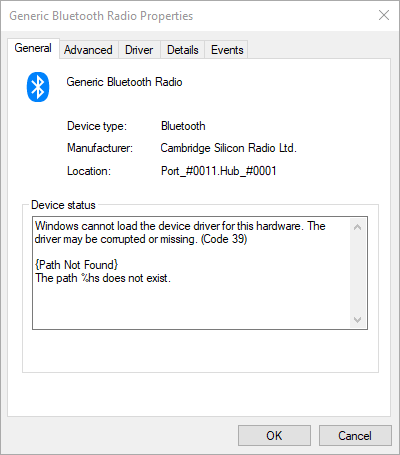

# Frequently Asked Questions about BthPS3

Got questions? Who can blame you 😅 we can provide some answers, though! Read on, traveler!

## How to fix this setup message?

[](/images/glvDeYjpQi.png){: .glightbox }

Your Bluetooth isn't working 🙂 If you're on a Laptop, make sure you haven't disabled wireless either via a physical switch or a key combination (depends on the device model). On Desktop, make sure you actually have a Bluetooth dongle plugged in 😉 If you had other solutions like ScpToolkit or AirBender installed, make sure they have been removed completely and you run stock drivers. If you don't see the little Bluetooth tray icon in your taskbar, chances are your Bluetooth isn't working or turned on. Fix it and setup will be happy 😘

## How to fix Bluetooth device error codes 19 & 39?

If you end up with a damaged/partial installation for whatever reason (computers, right? 😅) the setup or uninstaller might not even be able to do its work. Worry not though, if you check Device Manager and see that yellow exclamation mark on your Bluetooth host device, check the details and if they give you a familiar error code, like...


...or...



...this may look frightening, but in essence is an easy fix.

Fire up PowerShell as Administrator and execute:

!!! example "PowerShell"
    ```PowerShell
    Remove-ItemProperty -Path 'HKLM:\SYSTEM\CurrentControlSet\Control\Class\{e0cbf06c-cd8b-4647-bb8a-263b43f0f974}' -Name 'LowerFilters'
    ```

This removes the requirement to load the filter driver, which might be missing, and therefore prohibiting your radio to boot properly. After this line got executed, either power-cycle your radio or simply reboot and see if that issue got fixed ❤️

## What Bluetooth hosts are supported?

In short: all of them manufactured within the last decade and running proper stock drivers (means no ScpServer/ScpToolkit, no AirBender, stock as the manufacturer intended). [For details see this article](../Compatible-Bluetooth-Devices).

!!! warning "There's a catch"
    Only host radios using **USB** are supported! This includes the majority of external dongles or integrated cards (they use USB under the hood to connect to the rest of the system). So if your device is using something more exotic like I²C or UART, I'm afraid that's not gonna work 😔

## What controllers are supported?

!!! important "TL;DR"
    The genuine original Sony hardware, anything else is a nice-to-have that may or may not work ✨

This is unfortunately impossible to answer a 100% correctly. These drivers have been designed with compromises in mind. They aim to support the **original genuine Sony SIXAXIS/DualShock 3** (and Navigation, Move) controllers while operating within the realms of possibilities the Microsoft Bluetooth stack offers and allows. The DualShock 3 (or DS3 in short) has been a fairly popular piece of hardware and many clones have arisen over time, some coming close to the quality of the original, some... well, not quite as much. Aftermarket devices spoof (forge) the Hardware Identification Information that Windows sees and the labels and manufacturer notes on the housing itself. There simply is no rock-solid way to properly identify these devices to separate the good from the ugly. That's the inconvenient truth, any other statement would be a wild guess and not facts. [For details see this article](../About-Controller-Compatibility).

## Can I use my wireless Keyboard/Mouse/Headphones with this?

Yes, that's the whole purpose of this design 😉 BthPS3 *extends* the existing vanilla Bluetooth stack, it doesn't *replace* it (like ScpToolkit and alike did). This means it can never be as close to the original PlayStation Bluetooth stack (we need to play by Microsoft's design rules, remember?) as other solutions but the trade-off of keeping your stock wireless functionality should be worth it.

## How many devices can I connect at the same time?

There is no definitive answer to that one, as it depends heavily on the Bluetooth host hardware (quality, antenna design, size and position) and the amount of "noise" in your environment (Bluetooth is a fairly "weak" protocol compared to all the other radio chatter that's constantly happening in a common household). Users have reported all sorts of working constellations; like up to 6 controllers connected and working concurrently without any human-noticeable delay. So it's up to you to figure this one out! 😁

## Can it emulate another common controller, like Xbox One?

Controller emulation is *not* the job of these drivers, they provide the plumbing required to get them connected to Windows (and stay connected and keep talk), nothing more, nothing less. Other drivers (which you can find on this site) handle the controller-specific work required.

## Is there any noticeable input lag over Bluetooth?

Another stellar question! With no definite answer 😅 The truthful answer would be: don't know, don't care since it hasn't been measured with scientific equipment. The more down-to-earth answer comes from simple experience and interaction, human to machine: no. You might feel it working better or worse compared to USB, real or placebo. Those who ask this question usually just wanna hear "nope, it's all fine" so that they can move on. Well, there you have it, you can move on now 😘

## Why is the DualShock 4 even supported?

Because I can 😜 literally. It wasn't much extra work to add DS4 compatibility, as under the hood it operates quite similar to the DS3, without the unnecessary quirks. The DualShock 4 works natively without any custom drivers on Windows if paired in "PC mode" (PS and share button pressed at the same time until the light bar flashes rapidly), but a little known "secret" about this device is, that by default it operates in "PS mode" (PlayStation Bluetooth compatible) which BthPS3 can emulate! For now this doesn't really have any real-world advantages but leaves a backdoor for experimentation, if adventurous developers wanna talk to it they way the PlayStation originally does.

## How do I uninstall this?

In case you don't want/need the software anymore or you're getting this setup message:

[](/images/msiexec_2e33lI1uwF.png){: .glightbox }

Simply head over to Apps & features and uninstall from there:

[](/images/qBS61SD83D.png){: .glightbox }

Follow the instructions of the uninstaller and you're all set! 👋
