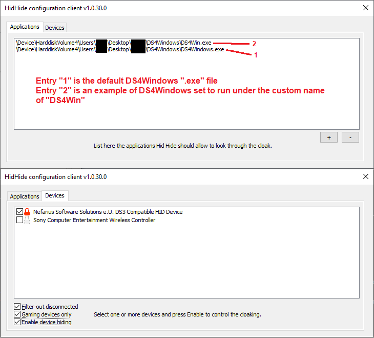
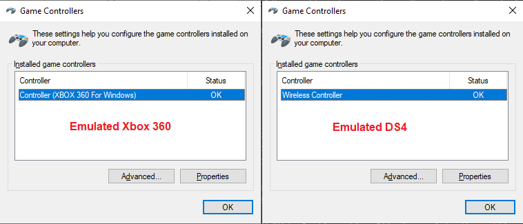
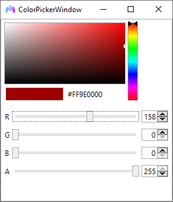
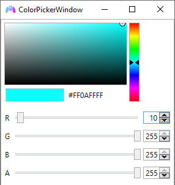
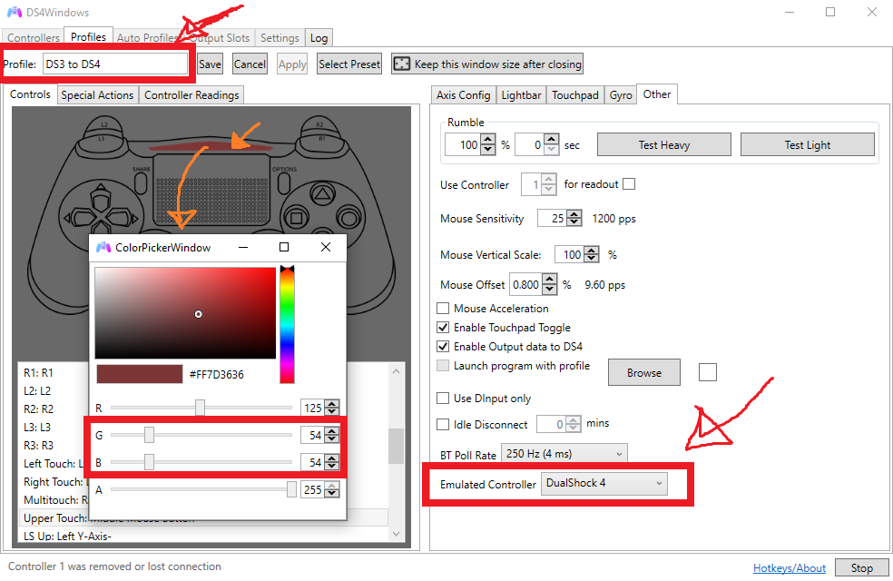
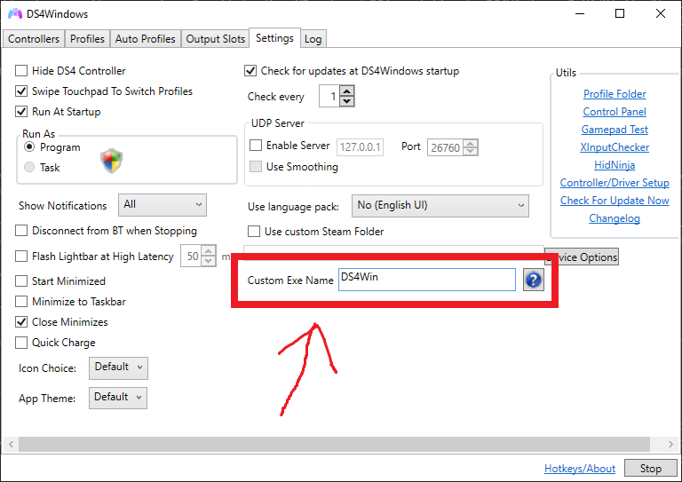

# DS4Windows Mode User Guide

!!! important "Jay2Kings' DS4Windows __IS NOT SUPPORTED__!"
    If you just search "DS4Windows" on Google/Bing/whatever the first result will probably be the obsolete Jay2Kings' version

In "DS4Windows" HID Device Mode, the controller appears as a custom device that can only be detected by [Ryochan7's DS4Windows](https://github.com/Ryochan7/DS4Windows), allowing the user to then emulate a DualShock 4 or Xbox 360 (__XInput__) controller as well as make use of most of its features.

## What does work

- Xbox 360 (__XInput__) / DualShock 4 emulation according to the selected profile settings in DS4Windows
- Rumble works as normal
- DS4's Touchpad Button can be used by remapping a button to it (e.g.: use Select as the _TP button_ instead of _Share_)
- DS3's LEDs can be controlled by setting the correct Light Bar colors (more on that on a later section)
- Basically every other DS4Windows function that is not related to the Light Bar or motion works as intended

## What does not work

- DS3 controllers are always recognized as if they were connected by USB. As such, DS4Windows Bluetooth functions like auto-disconnect on idle and disconnect on button combo are not supported. This is a limitation on DsHidMini side and can't be fixed by DS4Windows. [The built-in equivalent functions of DsHidMini](https://github.com/ViGEm/DsHidMini#features) should be used instead
- Motion/UDP server is not supported and will remain so until someone manages to translate the motion info from the DS3 to the DS4 motion standard
- Settings that make the Light Bar color flash, pulse or change randomly (rainbow mode) are not supported
- Specific DS4 touchpad movements are not supported, only the Touchpad Button and to use it another button needs to be remapped

## Verifying/Changing current DS3 HID Device Mode

Go [here](../HID-Device-Modes-Explained) on how to do so. The DS3 needs to be in "DS4 (DS4Windows)" mode to be detected by DS4Windows.

## Using the controller with DS4Windows

- Download the latest DS4Windows release package from [here](https://github.com/Ryochan7/DS4Windows/releases) according to your [Windows 10 version](https://www.howtogeek.com/howto/21726/how-do-i-know-if-im-running-32-bit-or-64-bit-windows-answers/)
- Extract the package to an easily accessible folder
- Run DS4Windows.exe
- Install the ViGEmBus Driver if asked to

After that, the controller should be properly recognized by DS4Windows. If it is not, go back to the previous section on how to verify/change the current DS3 mode.

## What now?

From here, DS4Windows can be used _mostly_ as usual. XInput and DS4 emulation, as well other functions, can then be set-up in the profiles settings according to the user needs. Read the _FAQ_ if you wante more detailed instructions on how to change to DS4 emulation. Besides that:

- __It is highly recommended that the next section, _Solving double input issues on games_, is followed through to prevent issues__
- If you want your controller's LEDs to represent the current battery level, go to _Example 2_ of the _Simple Led Control_ of the _Light Bar to LEDs translation_ section
- If you want the current selected profile to be represented by a specific LED or LED combination on the controller, read the _Light Bar to LEDs translation_ section 
- It's recommended you have a quick look at the _FAQ_ section, read at least the title of the topics

## Solving double input issues on games

Some games can end-up detecting two controllers/inputs when using DS3 with DS4Windows. This happens because the game is picking both the real controller input and the emulated Xbox/DualShock 4 controller created by DS4Windows. The 3 possible ways to solve this are:

- Using the built-in DS4Windows' function "Hide DS4" Controller (which can easily fail and is not recommended)
- Installing and using HidGuardian (works, but is complicated to use and is now obsolete because of the release of its successor, HidHide)
- Installing and using HidHide (HidGuardian's successor, recommended solution)

Because the first option is not recommended and the second is now obsolete, we'll follow the HidHide route.

!!! important "If you are using Windows 10 32 bits, read this!"
    HidHide only has a x64 version for now, so if you are on a 32bits/x86 system you'll need to follow the [old HidGuardian guide](https://vigem.org/projects/HidGuardian/DsHidMini-HidGuardian-Guide/) for now to prevent the double input issue until a x86 version of HidHide is released.

### Verifying if HidGuardian is installed and unninstalling it

!!! important "If you are definitely sure you don't have HidGuardian installed you can skip this part."

!!! important "If you use HidGuardian for other softwares, read this:"
    _To-Do_  :)

HidGuardian's installer utility can check if it's installed and correctly unninstall it in case it is, so that's what we are going to use:

- [Download and extract this archive](https://drive.google.com/file/d/1PNL3uv_4KektN00S9fm61djypSQ-3HED/view?usp=sharing)
- Inside the extracted folder, run HidGuardianInstaller.exe
- Check in the text log if HidGuardian is installed. If it is not, you can close the utility and move on to the next section

{: .glightbox }

- If HidGuardian is installed, click on the "Unninstall" button
- Wait until the utility finishes unninstalling HidGuardian, keep and eye on the text log to know what its status
- After the tool finishes unninstalling HidGuardian, close it then reboot your PC

### Installing HidHide

- Install [HidHide's prerequisites](https://support.microsoft.com/en-us/topic/the-latest-supported-visual-c-downloads-2647da03-1eea-4433-9aff-95f26a218cc0) according to your [Windows 10 version](https://www.howtogeek.com/howto/21726/how-do-i-know-if-im-running-32-bit-or-64-bit-windows-answers/)
{: .glightbox }
- Download the [Latest release of HidHide](https://github.com/ViGEm/HidHide/releases) (It should be a file called HidHideMSI.msi)
- Open the downloaded file and install HidHide as instructed
- After the installation, reboot your computer

### Hiding the controller

- Open the "HidHide Configuration Client" in the start menu
{: .glightbox }
- On the applications tab, click on the "+" button. On the new window that appears, locate and add the DS4Windows.exe file inside the DS4Windows folder
- ___If___ you have set your DS4Windows to run under a custom name then you __must also add the custom ".exe" file__ that you defined to the HidHide's application list
- With all your DS3 controllers connected, __double check if they all are in DS4 Mode__ by verifying if they all are being detected by DS4Windows
- On HidHide's Client, go to the _Devices_ tab and locate your DS3 controller. Its name should start with "Nefarius Software Solutions e.U."
- On your DS3 controllers entry, mark the white box before their names. A red lock icon should appear
- Mark the box in the bottom called "Enable Device Hiding" to (obviously) activate the hiding of the marked devices
- Your HidHid Configuration Client tabs should look more or less similar to picture below
{: .glightbox }
- Disconnect-reconnect your controllers and they should now be properly hidden
- Check if DS4Windows is detecting your controller. If it's not, you've incorrectly set the location of the DS4Windows ".exe" file
- To check if the DS3 controller is properly hidden, search on the windows start menu and then open "Set up USB game controllers". Your _Game Controllers_ window should look like the picture below depending on the selected profile in DS4Windows
{: .glightbox }

Keep in mind that:

- If the path to DS4Windows changes in any way (If you move/rename its folder or one of the folders where it is located) you will need to indicate the new path to HidHide, otherwise DS4W won't be able to detect the controller, so just re-open HidHide Configuration Client and add the .exe file on the new path

We sure hope this whole section becomes obsolete soon when DS4Windows adds native support to HidHide and white-lists itself/lock controllers automatically.

From here, everything should be correctly set. Your DS3 is now a Xbox 360 / DS4 controller and the real DS3 is properly hidden. All that's left is to enjoy your games!

## Light Bar color to LEDs translation

By setting the correct Light Bar color values in the profile settings it is possible to control the LEDs on the DS3, which can be useful to:

- Make the controller's LEDs represent the current battery level 
- Represent the current selected profile as a specific LED
- Indicate the battery level by using _Special Actions_ in the profile's settings

Beware that functions in DS4Windows that make the Light Bar flash, pulse or randomize the colors (rainbow mode) are not supported and can make the LEDs change to an undesired state. Because of this, the function "Flash Light Bar at High Latency" does not work as intended with a DS3.

### Simple LED control

- Only 1 LED can be ON at a time
- Simple to set-up
- Good to represent which profile is active (see example 1)
- Necessary when making DS4Windows show the controller's battery level and for battery related _Special Actions_ (see examples 2 and 3 respectively)

To activate this form of Light Bar color translation, both the values of the Green and Blue colors must be set as "0". After that, the Red color value will be translated to the LEDs state according to the following table:

| RED value (Dec) |  RED value (Hex) | LED state |
| :---: | :---: | :---: |
| 0-63 | 00-3F | LED 1 ON |
| 64-127 | 40-7F | LED 2 ON |
| 128-191 | 80-BF | LED 3 ON |
| 192-255 | C0-FF | LED 4 ON |

e.g. 1: Setting up a profile to be represented as LED 3.

{: .glightbox }

e.g. 2: Setting up a profile to reflect the controller's battery level.

{: .glightbox }

e.g. 3: Setting up a _Special Action_ to make the LEDs reflect the controller's battery level.

{: .glightbox }

### Complete LED control

- "Harder" to set-up (not really).
- Allows any combination of LEDs on.
- Useful if the user wants to differentiate between more than 4 profiles.

To activate this form of Light Bar color translation, both the values of the Green and Blue colors must be set as "255". After that, the Red color value from 0 to 15 will be translated to the LEDs state according to the following table:

| LED 4 |  LED 3 | LED 2 | LED 1 |  RED value (Dec) |  RED value (Hex)
| :---: | :---: | :---: | :---: | :---: | :---: |
|  |  |  |  | 0 | 0 |
|  |  |  | ON | 1 | 1 |
|  |  | ON |  | 2 | 2 |
|  |  | ON | ON | 3 | 3 |
|  | ON |  |  | 4 | 4 |
|  | ON |  | ON | 5 | 5 |
|  | ON | ON |  | 6 | 6 |
|  | ON | ON | ON | 7 | 7 |
| ON |  |  |  | 8 | 8 |
| ON |  |  | ON | 9 | 9 |
| ON |  | ON |  | 10 | A |
| ON |  | ON | ON | 11 | B |
| ON | ON |  |  | 12 | C |
| ON | ON |  | ON | 13 | D |
| ON | ON | ON |  | 14 | E |
| ON | ON | ON | ON | 15 | F |

e.g. Setting up a profile to be represented as LEDs 4 and 2.

{: .glightbox }

## Frequently Asked Questions

### "_How do I change between XInput and DS4 emulation?_"

The controller that DS4Windows emulates is dependent on the current selected profile. By default, the profile that comes with DS4Windows called... _Default_... is set to emulate a Xbox 360 controller. To change to DS4 emulation you can Edit the _Default_ profile, though it is recommended you create a new specific for DS4 emulation. To create a new profile:

- Go to the _Profiles_ tab
- Click on the "New" button to create a new profile
- When asked if a preset is to be used, choose "yes" then "Gamepad"
- On the right side go the _Other_ tab
- In the final option of the _Other_ tab, "Emulated Controller", change from _Xbox 360_ to _DualShock 4_
- Adjust the Light Bar color related settings according to what you want according to the _Light Bar to LEDs translation_ section (in the example below the profile will be represented by LED 2)
- Give a name to your profile (e.g.: DS3 to DS4)
- Save the profile
- Back in the _Controllers_ tab, click on the _Selected profile_ box and change from default to the profile you just created

{: .glightbox }

And done, now you can switch between XInput/DS4 emulation by changing between profiles. Profiles can also be switched by button combinations by setting a _Special action_ inside each profile settings, though we will not cover this in this guide.

### "_Why this convoluted setup? I just want to use my DS3 as a XInput/DS4 controller!_"

Basically, because it was easier. By off-loading XInput and DS4 emulation to DS4Windows, DsHidMini's BETA release "to-do" list got smaller, more important features and issues could/can be prioritized and it's easier to solve bugs with a smaller code. This all led to the BETA release of DsHidMini happening sooner.
With that said, we are aware that it _is_ convoluted right now and we hope things get easier for the user if/when:

- DS4Windows has native integration to HidHide, white-listing itself and automatically hiding detected controllers
- DS4 Mode is made "invisible" to games/application by default on DsHidMini. This is being considered but it's not certain since it requires alterations on DS4Windows side
- Direct XInput/DS4 emulation is implemented

### "_So direct XInput/DS4 emulation is a possibility?_"

Yes. Actually, it is dead easy right now to directly emulate a DS4 since the DS3 in "DS4 Mode" _is_ a DS4, the only difference is that its hardware ID was changed to something only DS4Windows recognizes. The problems with allowing the user to enable direct DS4 emulation right now are:

- Some games that support DS4 use the TouchPad button for things like maps or options menu. Because the D4's TP Button is an extra button that the DS3 don't have, this means that the TP Button would need to be a button combination or replace another used button, which means: having to actually implement all the logic involved in the driver _and_ in the DsHidMini Control Utility, which means more work and more code, so more chances of bugs, more things to test etc
- XInput emulation is more difficult for _reasons_ and its _way easier_ to off-load this work to something else. If the user would need to use some program to emulate XInput, then why not DS4Windows? And in this case, why not leave DS4 emulation to it as well?
- Users that would want to remap buttons/axis would end up in this situation anyway

DS4Windows offers macros, remap function, the ability to change modes without disconnecting the controller, control the DS3 LEDs and more _already_. Not Later, __right now__. While direct emulation is a possibility and on DsHidMini's _To-Do_ list it's in no way a priority, so don't hold your breath for it.

### "_I can't control Steam's Big Picture when using a emulated DS4 / Steam doesn't detect my controller when it's emulated as a DS4, only when emulated as a Xbox 360 one_"

Steam (and some really specific games, super rare case) will fully ignore DS4 controllers if it detects that DS4Windows is running. This happens so users don't accidentally have both DS4Windows and Steam remapping the controller. Regardless if Steam is detecting or not the emulated DS4, 99.9% of the games that support DS4 controllers should detect the emulated one as normal.

For Steam to properly detect the emulated controller you need run DS4Windows under a custom ".exe" name. Just open DS4Windows -> Go into the _Settings_ Tab -> Write the name you want on the "Custom exe name" box (In the image below the name "DS4Win" is used as an example). After the name is set, fully close then re-open DS4Windows and then Steam shoud detect it as normal. It's also recommended to go into the Steam's settings -> Controller -> General Controller Configurations -> Leave "Playstation Configuration Supported" UNCHECKED, so Steam doesn't remap your controller when you don't want it to.

!!! important "Attention!"
    When running DS4Windows under a custom name it uses a different .exe file that has the chosen custom name. If you are using HidHide remember to add this new file to the applications list on its Configuration Client, otherwise DS4Windows won't be able to pick the real DS3 controller anymore.

{: .glightbox }

### "_X game does not detect my emulated DS4 / my game is not showing PS button icons_"

- First, double check if the game actually supports DS4 controllers _and_ has native PS icons when played with a DualShock 4. There is no direct way to check this besides Googling around and looking at forums
- If the game does not support DualShock 4/PS icons then that's in no way related to us and we can't do anything about it
- If you are 100% sure the game supports PS button icons/DualShock 4, then this could be related to the issue above that is related to Steam not detecting the controller
- If the game still doesn't recognize the emulated DualShock 4 then we have no idea what's going on and you are welcome on reaching us [through here](https://vigem.org/Community-Support/)

### "_How do I use DS4's TouchPad button?_"

Because DS4Windows does not support mapping a button combination to anything TouchPad related right now, you'll need to remap a button to it:

- Duplicate your DS4 profile, choose a different name to it
- Edit the new profile
- On the left side, click on the button you want to remap in the DualShock 4 picture
- On the new window that appears select the middle of the touchpad
- Save your profile and switch to it

### "_How do I do 'X' thing on DS4Windows_"

DS4Windows is a really amazing tool that can do lots of things, but the purpose of this guide isn't covering DS4Windows in itself, it's to give users the minimum necessary to have XInput/DS4 emulation and to cover DsHidMini related functions, like Light Bar color to LEDs translation. Because the other things it can do are not related to DsHidMini then it's recommended that you look in [its wiki](https://github.com/Ryochan7/DS4Windows/wiki/Settings) or google around for online tutorials. 
