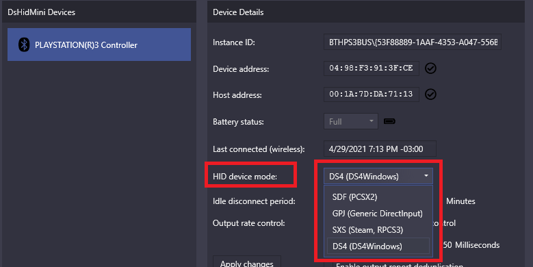
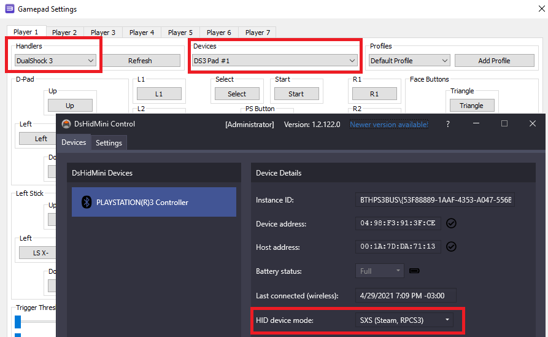
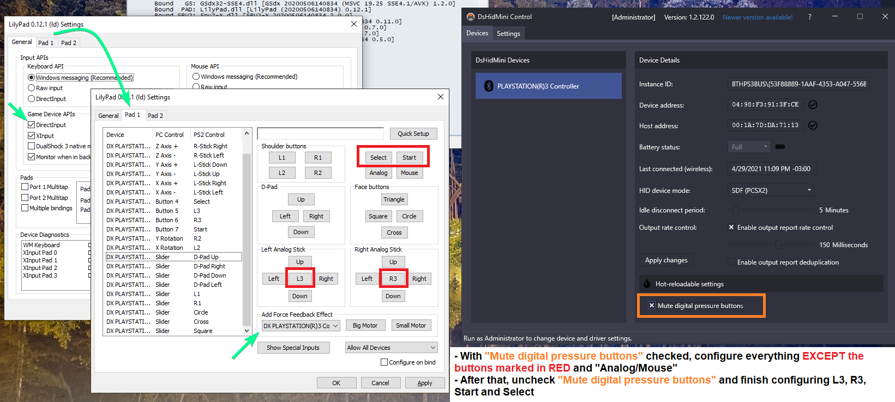

# Frequently Asked Questions

## XInput? DS3? DS4? What are you talking about?

!!! note "Know the terms"
    - Standard PS3 controller => DualShock 3 (__DS3__)
    - Standard PS4 controller => DualShock 4 (__DS4__)
    - __Xbox 360__ controller => __XInput__ controller/device

## What is DsHidMini?

Check out the repository [README](https://github.com/ViGEm/DsHidMini/blob/master/README.md) and the [main project page](https://vigem.org/projects/DsHidMini/).

## I am already using ScpToolKit / MotionInJoy / Shibari / Whatever, should I move to DsHidMini?

That is entirely up to you of course 🙂 Do you wish to stick with abandoned, outdated, unmaintained, complex and potentially untrustworthy software that will work less and less the further Windows and Games advance or do you want to step into the light and use fresh, stable, thought-through open software that simple delivers what it promises? Your call 😉

## How do I use it?

- Follow the [_How to Install_ guide](../How-to-Instal)
- Learn the  about different [DsHidMini HID Device Modes](../HID-Device-Modes-Explained) your controller can be, the characteristics each mode and how to change between them

After DsHidMini is active and the controller connected, you just need to change to the mode best suited to your use case. Keep in mind that if you want to use your controller as a __XInput__ (Xbox 360) or __DualShock 4__ controller, [there are a few extra steps left to be followed](#how-do-i-use-my-controller-as-a-xbox-360-or-dualshock-4). 

{: .glightbox }  

## Does my fake PS3 controller work with DsHidMini?

Short answer: it depends. Long answer: [it depends](https://vigem.org/projects/BthPS3/About-Controller-Compatibility/) 🙂 This is community software with no ties to any hardware manufacturer, all we can provide is knowledge based on research and reverse engineering.

## What are the HID Device Modes? Which one should I use?

Go back to the [_How do I use it?_](#how-do-i-use-it) question.

## What does my controllers' LED represent? How do I quickly disconnect the controller on Bluetooth?

Read the [_Features_ section](https://github.com/ViGEm/DsHidMini#features) of the main GitHub page of DsHidMini.

## How do I use my controller as a Xbox 360 or DualShock 4?

### Recommended method

Set the controller into `DS4Windows Mode` and use it with __Ryochan7's DS4Windows__. For more detailed instructions and other information, follow the [_DS4Windows Mode User Guide_](../DS4-Mode-User-Guide) and you'll be good to go.

{: .glightbox }  

### Alternative methods

If, for whatever reason, you don't want to use DS4Windows and prefer to choose your own remapping tool, then you have the following options:

- __Using the Controller in `SXS Mode` + Steam:__ Steam will detect the controller as an official PlayStation 3 controller as long as `PlayStation configuration support` is enabled. XInput and DS4 emulation are then done automatically according to what Steam thinks the game supports.

- __Using the controller in `SDF or GPJ Mode` + another remapping software:__ in `SDF/GPJ Mode` the controller is presented as a generic gamepad which can then be used with remapping tools like x360ce, UCR etc.

## What is the best way to use my controller in games/emulators?

The answer is: ___it depends___.

You need to verify which `Input API` is supported in whatever you are using and if you want to use DS3 specific functions, like pressure buttons or motion controls. The following table should help you:

| "I want to..." | How to use your DS3 (recommendation) | Notes |
| :---: | :---: | :---: |
| Play modern PC games | `XInput` or `DualShock 4`  | Check the [_How do I use my controller as a Xbox 360 or DualShock 4?_ section](#how-do-i-use-my-controller-as-a-xbox-360-or-dualshock-4). Not all modern games support DS4 controllers, and those that do support it sometimes don't support its rumble |
| Use the DS3 as a common gamepad for most emulators | `XInput` or `GPJ Mode` | The gamepad part of `GPJ Mode` should be compatible with emulators that support only `DirectInput` |
| Use RetroArch | `XInput` | Though RetroArch does support `DirectInput`, its rumble support is currently broken. `XInput` should be used instead to have working rumble |
| Use RPCS3 | `SXS Mode` | Check the [_How do I use DsHidMini with RPCS3?_ section](#how-do-i-use-dshidmini-with-rpcs3) |
| Use the DS3 in PCSX2 with pressure buttons | `SDF Mode` | Check the [_How do I set the controller's pressure buttons in PCSX2?_ section](#how-do-i-set-the-controllers-pressure-buttons-in-pcsx2) |

## How do I use DsHidMini with RPCS3?

!!! note "A [video demonstration of DsHidMini with RPCS3 video](../#2021-02-27-dshidmini-demo-rpcs3) is also available"

It's recommended that you use your DS3 controller in `SXS Mode` and then choose on RPCS3's controller settings the `DualShock 3` Handler. When doing so, RPCS3 should automatically pick and set your DS3, with full support to all its functions including LEDs, pressure buttons and motion.

{: .glightbox }  

## How do I set the controller's pressure buttons in PCSX2?

!!! note "A [video demonstration of DsHidMini's pressure buttons with PCSX2](../#2021-03-08-dshidmini-sdf-mode-explained-with-pcsx2-v170) is also available"

The recommended method is the following:

- Set the controller into `SDF Mode`
- Go to PCSX2 input settings
- Make sure `DirectInput` is activated at the `Game Devices APIs` options (__DO NOT CHECK__ the `DualShock 3 native mode` box)
- Open the DsHidMini Control Client and check the `Mute digital pressure buttons` checkbox
- Back to PCSX2 input settings, on the `Pad X` tab, __configure everything EXCEPT__ __L3__ / __R3__ / __Start__ / __Select__ / __Analog__ / __Mouse__
- Go into the DsHidMini Control Client and uncheck the `Mute digital pressure buttons`
- Finish setting the L3 / R3 / Start / Select buttons. The `Analog` and `Mouse` buttons are not necessary
- At the `Add Force Feedback Effect` select your DS3 controller
  - Only `Constant Force` is required/supported, don't select any other effect, it will not work
- Finish by clicking on `OK`

{: .glightbox }  

## How do I use the motion sensors with emulators?

The only emulator that can use the DS3 motion sensors is the RPCS3 when using the DualShock 3 handler.

For now, __it's impossible to use the controller's motion with other emulators__, like CEMU, Yuzu, Dolphin etc. The reason for this is that the PS3 controller only has 1 gyroscope, while modern controllers have 3 gyros. While it's possible to "emulate" the missing gyros by using the sensors it does have, the whole process involves many _maths_ that are not implemented at the moment and are at the very bottom of DsHidMini's To-Do list.

## I'm having "X" problem when using DsHidMini, what should I do?

- __Trouble when installing DsHidMini or connecting your controllers to the computer:__ check the [_How to Install Troubleshooting_ section](../How-to-Install/#troubleshooting)
- __Controller works normally most of the time but have random button presses or buttons fail to register:__ most likely a hardware fault, not related to DsHidMini

If you have a different situation than the ones above, feel free to [reach us through the proper means](https://vigem.org/Community-Support/).
