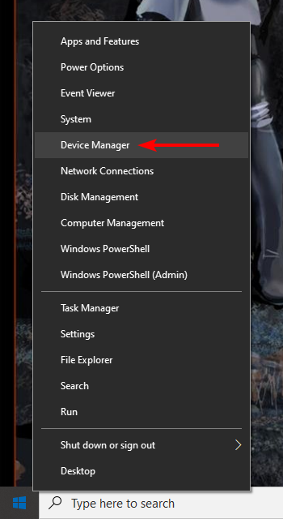
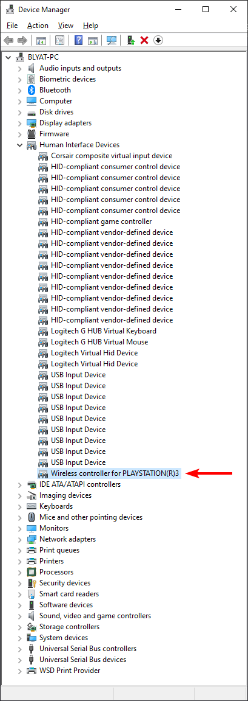
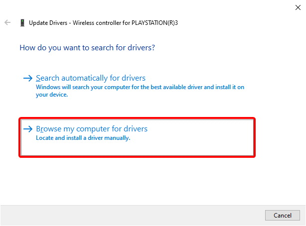
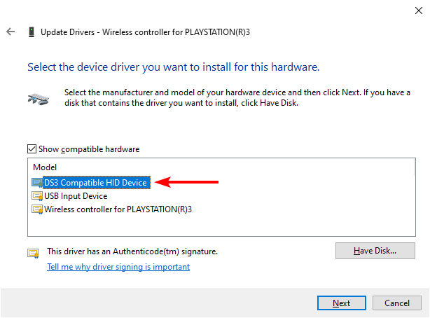
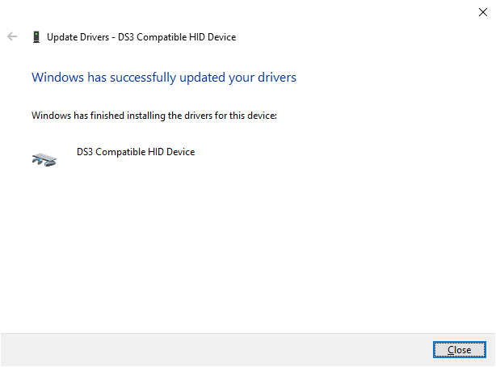
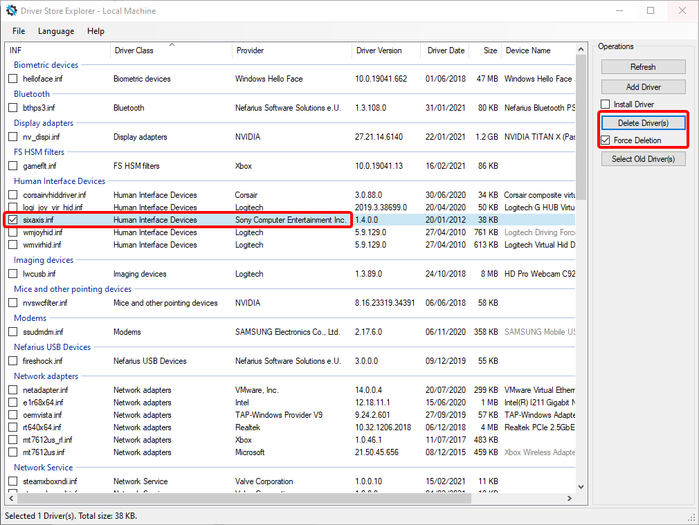

# Switch from SIXAXIS.SYS to DsHidMini

- Plug in your controller
- Open Device Manager by pressing ++win+x++ and select it from the menu:  
{: .glightbox }  
- Expand `Human Interface Devices` and look for `Wireless controller for PLAYSTATION(R)3`  
{: .glightbox }  
- Right-click it and select `Update driver`  
{: .glightbox }
- Follow the wizard:  
{: .glightbox }  
{: .glightbox }  
{: .glightbox }  
{: .glightbox }  
- Use [Driver Store Explorer](https://github.com/lostindark/DriverStoreExplorer/releases) to remove the `sixaxis.inf` driver:  
{: .glightbox }  

Done 🎉
