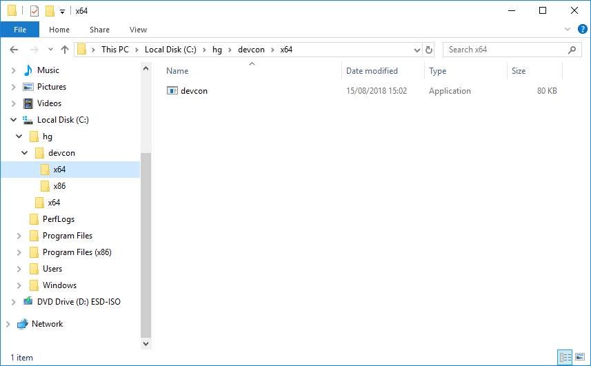
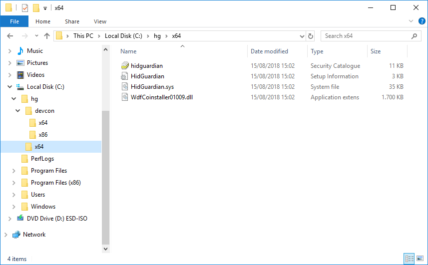

# HidGuardian (Gen1) Installation

!!! important "Attention"
    This article covers the installation of the (deprecated) HidGuardian **major version 1** (a.k.a. **Gen1**) driver. Its development has been discontinued yet there's software out there depending on it. Please make sure you need **version 1** first before going through this article!

## About

`HidGuardian` (abridged as `HG`) v1 is very limited in functionality. It was more of a [proof of concept (PoC)](https://en.wikipedia.org/wiki/Proof_of_concept) than a full blown product. Nonetheless it can still assist you in blocking input devices which is its core intention.

!!! important "Attention"
    If you're a developer starting with a fresh project, please refrain from using `HG` v1 as it won't receive any new features or fixes, thank you!

Some facts about `HG` v1:

- Configured via registry keys and values
- Can only whitelist processes based on PID (numeric Process ID)
- Has no real "official" API so might break between minor releases

### Projects known to depend on HG v1

This list is in no way complete as we rely on community/developer feedback. Some known products include:

- [DS4Windows (Ryochan7 fork)](https://github.com/Ryochan7/DS4Windows)

## Preparations

👉 [Grab the driver archive matching your systems architecture from here](https://downloads.vigem.org/projects/HidGuardian/stable/1.14.3.0/windows/) and extract them (e.g. to `C:\hg`)

!!! info "Hint"
    Some morons/trolls might have told you that you have to put drivers into `system32` folder. **Don't do that**, Windows can take care of its drivers by itself, fooling around in your system folders can brick your machine. You have been warned.

👉 [Now get the Device Console (devcon) utility](https://downloads.vigem.org/other/microsoft/devcon.zip) and also extract it somewhere (e.g. to `C:\hg`)

So the folder structure you end up with should look like so:

 

 

## Driver installation

Alright, here we go 😊 take one last deep breath and continue reading carefully and nothing will go wrong.

[Fire up PowerShell as Administrator](https://www.top-password.com/blog/5-ways-to-run-powershell-as-administrator-in-windows-10/) and insert the following commands one after another:

```text
C:\hg\devcon\x64\devcon.exe install C:\hg\x64\HidGuardian.inf Root\HidGuardian
```

Which is expected to return:

```text
Device node created. Install is complete when drivers are installed...
Updating drivers for Root\HidGuardian from C:\hg\x64\HidGuardian.inf.
Drivers installed successfully.
```

!!! info "Hint"
    This command created a virtual "dummy device" so the driver can get loaded.

And finally:

```text
C:\hg\devcon\x64\devcon.exe classfilter HIDClass upper -HidGuardian
```

Which is expected to return:

```text
Class filters changed. Restart the devices or reboot the system to make the change effective.
    HidGuardian
```

!!! info "Hint"
    This command internally adjusted some registry values causing the driver to get loaded onto every input device automatically.

That's it! You're ready to rock 🎉

!!! important "Attention"
    You'll either need to unplug and plug in your input devices or reboot the machine for the driver to work!

 

## Driver removal

!!! important "Attention"
    Removing `HG` requires a special procedure described here or else you could end up with no keyboard/mouse!

For removal you don't need the original driver files, you will need `devcon` though so make sure you got it ready as described earlier.

👉 Then from an elevated PowerShell execute:

```text
C:\hg\devcon\x64\devcon.exe classfilter HIDClass upper !HidGuardian
C:\hg\devcon\x64\devcon.exe remove Root\HidGuardian
```

!!! info "Hint"
    It might have accidentally happened that your system has more than one virtual device. If that's the case, simply execute the two commands multiple times until they're all gone.

Now reboot and you're good to go 😄

### Registry clean-up

Some registry keys and values can be safely removed manually after the driver is gone.

In `Computer\HKEY_LOCAL_MACHINE\SYSTEM\CurrentControlSet\Services\HidGuardian\Parameters` the following values can be removed (if they exist):

- `AffectedDevices`
- `ExcemptedDevices`
- `Force`

The key `Computer\HKEY_LOCAL_MACHINE\SYSTEM\CurrentControlSet\Services\HidGuardian\Parameters\Whitelist` and all sub-keys can be removed as well.

