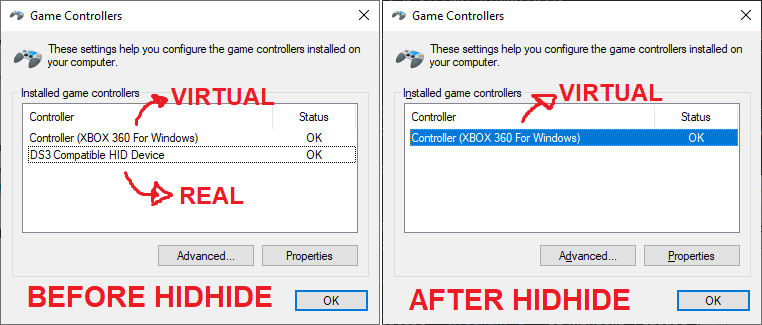
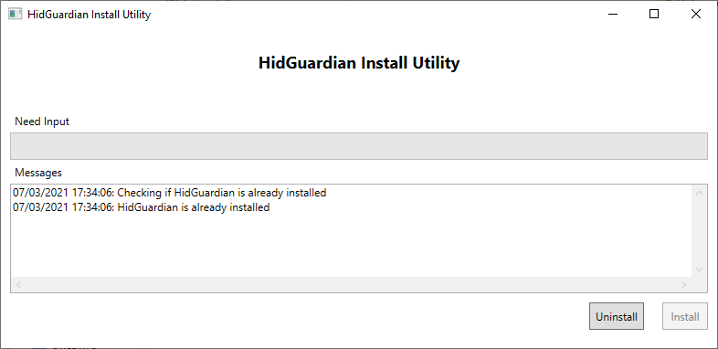
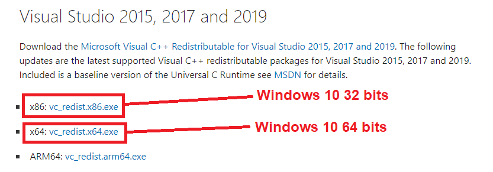
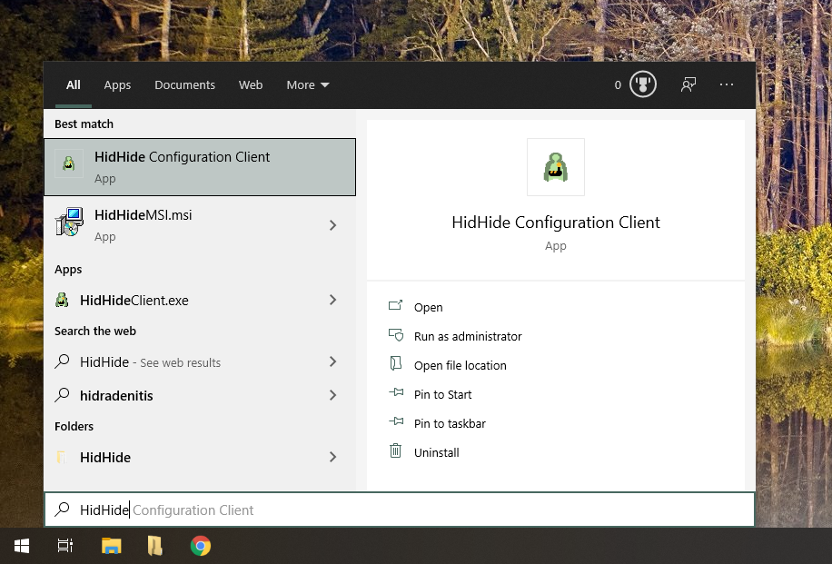
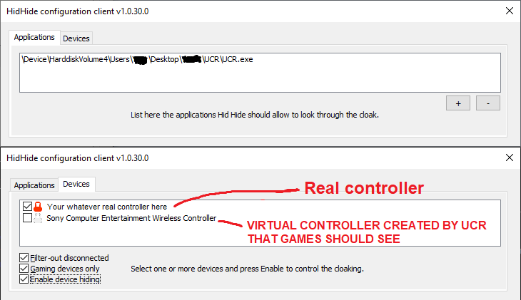

# Simple setup guide

!!! important "HidHide is only supported on 64 bits Windows 10 as for the day this article was written."

## What is HidHide and why one might need it

HidHide is a filter driver than can "hide" Gamepads/joysticks devices (ensuring Windows and other applications stop detecting it as a game controller) and allowing only chosen applications to see them.

You don't understand how that could be useful? Imagine the following scenario: you have a Generic Gamepad that you want to _convert_ into a __XInput Device__ (a Xbox 360 controller) since most games are already pre-configured to the XInput layout, or maybe the game doesn't even detect your controller as it is. So you start using a remapping program ( [x360ce](https://www.x360ce.com/) / [XOutput](https://github.com/csutorasa/XOutput) / [UCR](https://github.com/Snoothy/UCR) / etc ) that allows you to remap your controller into a virtual XInput / DS4 controller.

This put you in a problematic situation: you don't end-up ___just___ with the virtual controller that you want to use. No no, you end-up with 2 controllers: your real controller, the Generic Gamepad, and the emulated one, a Virtual XInput/DS4.

If the games you are playing don't even detect your Real Controller, then all good. The issue starts when the game detects both real and virtual controllers while you only want it to recognize the virtual one. Since most games auto-detect controllers, the game will think there are 2 separate controllers connected, leading to the famous Double-Input and mis-input issue. Eg.:

- Rocket league will start 2 player mode randomly
- Blasphemous will switch randomly between generic and XInput button icons
- Need for Speed: Most Wanted (2012) will keep warning the player an unknown device needs to be setup, interfering with gameplay

This issue can be solved by using HidHide to:

- Hide the real controller
- Only allow the remapping tool of your choice to see the controller, since it needs to pick its input to translate them to the Virtual one 
{: .glightbox }

## Verifying if HidGuardian is installed and uninstalling it

!!! important "If you are definitely sure you don't have HidGuardian installed you can skip this part."
    HidHide is HidGuardian's successor. Since both have the same function, it's better if HidGuardian is not present in your system to prevent confusion on what software is hiding which controller

HidGuardian's installer utility can check if it's installed and correctly uninstall it in case it is, so that's what we are going to use:

- [Download and extract this archive](https://drive.google.com/file/d/1PNL3uv_4KektN00S9fm61djypSQ-3HED/view?usp=sharing)
- Inside the extracted folder, run HidGuardianInstaller.exe
- Check in the text log if HidGuardian is installed. If it is not, you can close the utility and move on to the next section

{: .glightbox }

- If HidGuardian is installed, click on the "Uninstall" button
- Wait until the utility finishes uninstalling HidGuardian, keep and eye on the text log to know what its status
- After the tool finishes uninstalling HidGuardian, close it then reboot your PC

## Setting up HidHide (Simple guide)

- Download the [Latest release of HidHide](https://github.com/ViGEm/HidHide/releases) (It should be a file called HidHideMSI.msi). Remember to install its prerequisites as written on the page
- After installation, reboot your computer
- Open the `HidHide Configuration Client` in the start menu
- On the `Applications` tab, add the applications that should be able to see the devices even when they are hidden
- On the `Devices` tab mark the controllers you want to be hidden (a red lock should appear), then mark the `Enable device hiding` Checkbox
- Reconnect your controllers to make the changes effective

DONE. Be happy.

## Setting up Hidhide (Step-by-step guide)

### Installing HidHide

- Install [HidHide's prerequisites](https://support.microsoft.com/en-us/topic/the-latest-supported-visual-c-downloads-2647da03-1eea-4433-9aff-95f26a218cc0) according to your [Windows 10 version](https://vigem.org/research/How-to-check-architecture/)
{: .glightbox }
- Download the [Latest release of HidHide](https://github.com/ViGEm/HidHide/releases) (It should be a file called HidHideMSI.msi)
- Open the downloaded file and install HidHide as instructed
- After the installation, reboot your computer

### Hiding the controller

- Open the "HidHide Configuration Client" in the start menu
{: .glightbox }
- On the Configuration Client, click on the `Devices` tab to show the list of connected controllers
- Have the controllers you want to hide connected to your computer
- On your controllers entries, mark the white box before their names. A red lock icon should appear
- If your controller can connect both via cable and Bluetooth, reconnect your controllers via the other connection method and also mark their new entries
- Mark the box in the bottom called "Enable Device Hiding" to (obviously) activate the hiding of the marked devices
- __RECONNECT__ the marked devices so the changes are effective

At this point, your controllers should be hidden. To verify, open Windows' `joy.cpl` by one of the following methods:

- Pressing the key combination ++win+r++ and then entering `joy.cpl` ___OR___
- Searching and opening on Windows' Start Menu `Set up USB Game Controllers` 

Assuming the hidden controllers are the only ones connected to the system, no device should show up in the Game Controller's list 

### Allowing chosen applications to see hidden devices

Now that your controllers are hidden, you need to select which applications should be able to detect them:

- On the Configuration Client, click on the `Applications` tab
- Click on the `+` icon and add the executable file of your application (`ApplicationName.exe`)  to whitelist it
- Repeat the step above for each application that should whitelisted
- After that, __RECONNECT__ your controllers so the changes are effective

From this point, the applications on the list should be able to detect the hidden devices. The image below is an example of the application "UCR" being able to see a hidden Controller and creating a Virtual DS4: 
{: .glightbox }

!!! important "Users of DS4Windows: PAY ATTENTION!"
    If you are running DS4Windows under a custom `.exe` name (look at the DS4Windows' `Other` tab) then the custom named executable must also be on the list

## What now?

If you've set everything correctly then all that is left is for you to enjoy! Before you leave, have a quick look in the next section and on the `Frequently Asked Questions` article on the side-bar (I mean... if it has already been created).

## Things to keep in mind

Common things to know regarding using HidHide with your controllers:

- Contrary to HidGuardian, HidHide affects isolated devices instead of device types. This means that if you have (for example) 4 different controllers that are the exact same model, you would still need to mark each one as hidden separately, both on USB and on Bluetooth
- If you think something is wrong and want to disable HidHide to run tests, just open the `HidHide Configuration Utility`, go into the `Devices` tab and un-check the `Enable Device Hiding` checkbox (if this doesn't make the devices visible again, try then reconnecting them)
- HidHide whitelists applications based on their location in your computer. This means that if you whitelist "UCR.exe" that is on your desktop, but then move it to another folder you will need to whitelist it again on its new location
- Applications may add native support to HidHide in future updates, automating the process by whitelisting themselves and auto-hiding detected controllers

