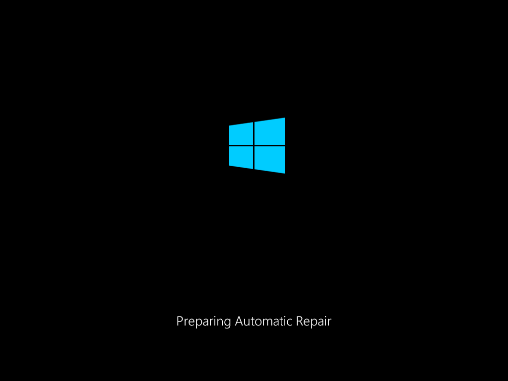
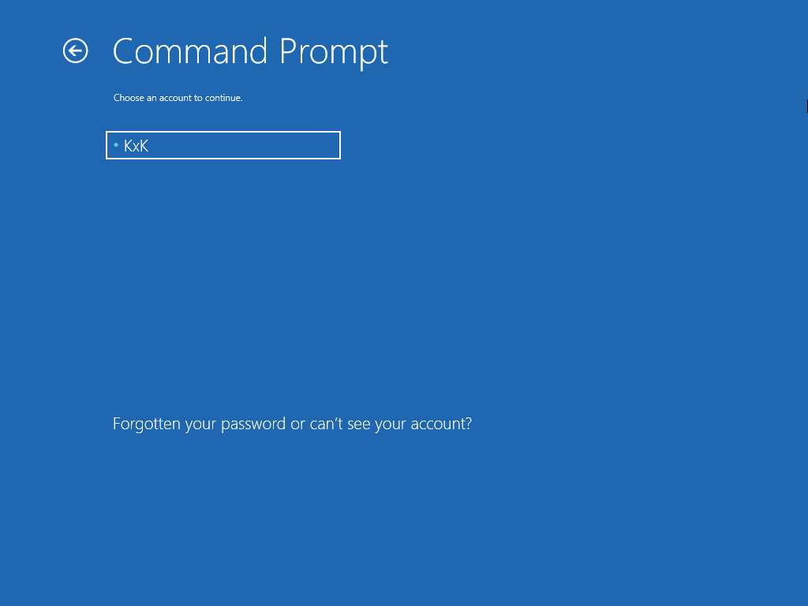
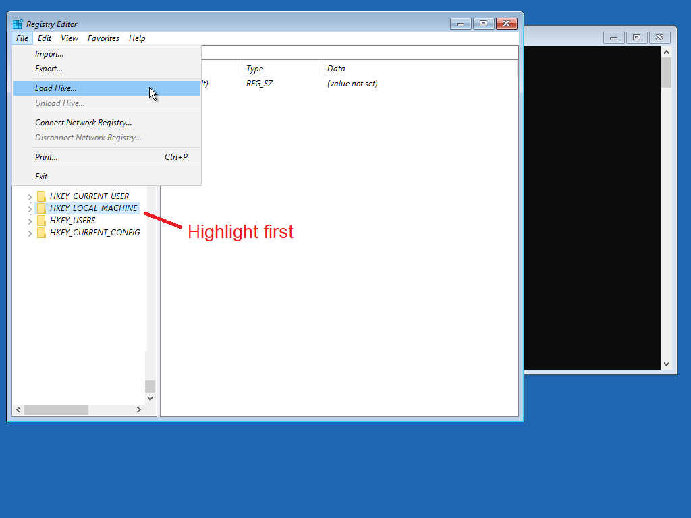
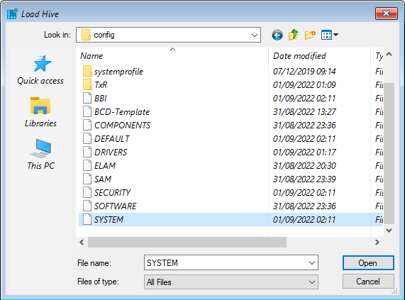
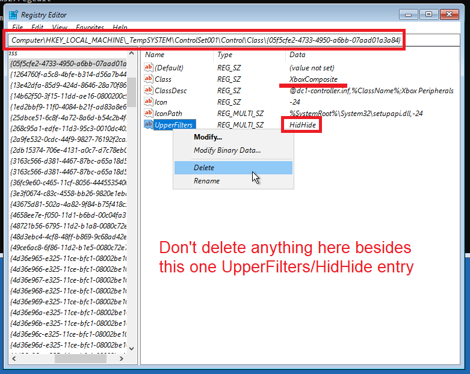
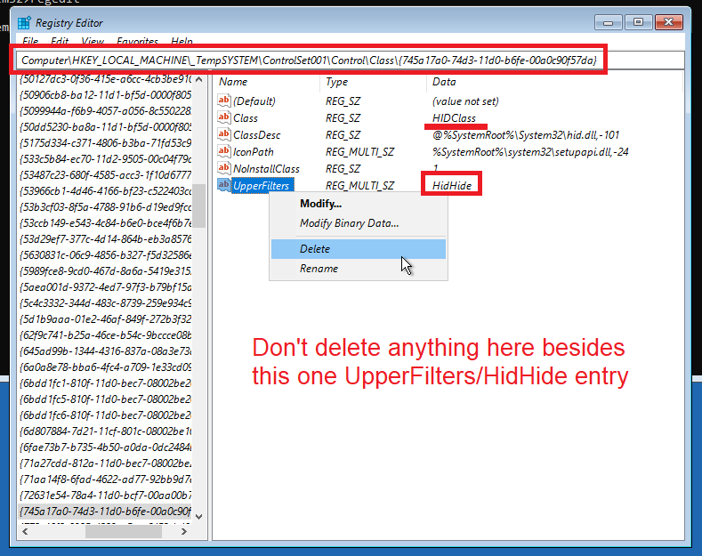
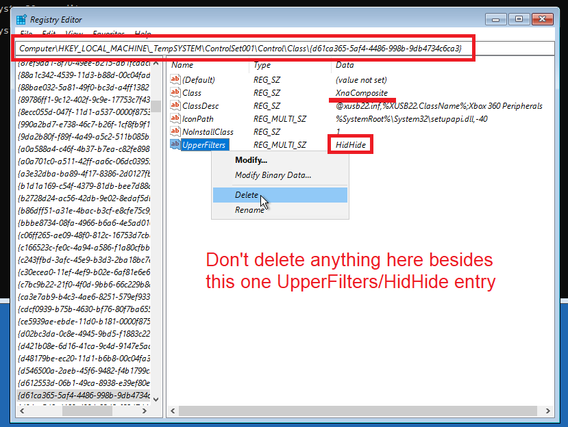
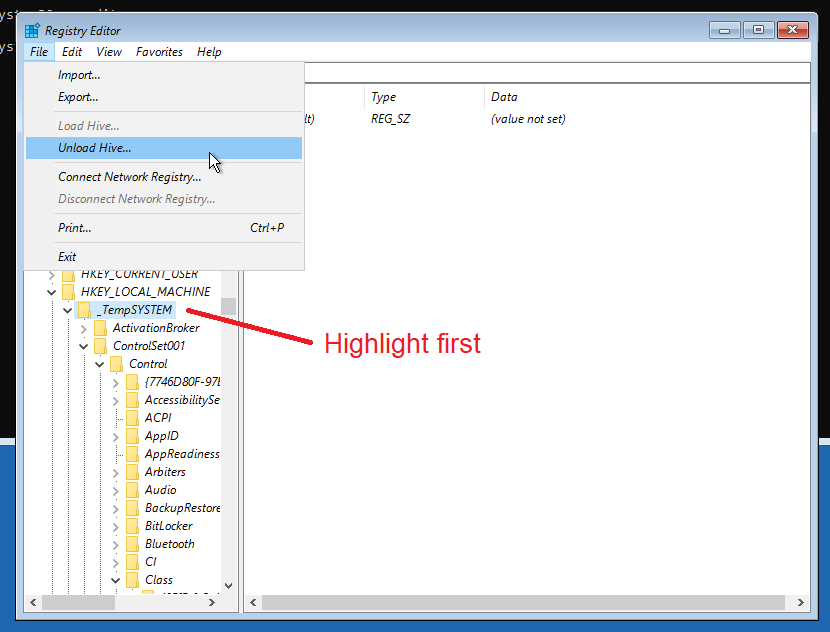
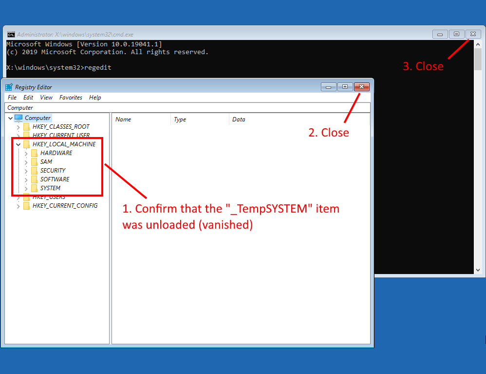

# Fixing an improper removal of HidHide

## To whom this guide applies to

This page's objective is to guide the user in how to recover the system from a forced HidHide removal attempt that resulted in XInput and HID Devices (Keyboard, Mouse, Controllers) not working anymore.

If your system is working as normal and you just want to uninstall HidHide open Windows' Apps and Features menu and search for HidHide's uninstaller there.

## To whom this guide does NOT apply

This guide does NOT apply to those that...

- have their system working as normal and just want to uninstall HidHide
    - Just open Windows' Apps and Features menu and search for HidHide's uninstaller there
- can use their Keyboard and Mouse as normal in Windows
- _think_ their controller is not working because of HidHide
    - There are other more likely causes for this than HidHide being "broken". If your keyboard and mouse is working as normal but not your controllers then try the following:
        - Use the [Nefarius' Legacinator tool](https://github.com/nefarius/Legacinator/releases) to check if you have HidGUARDIAN installed and uninstall it in case if positive (reboot after)
        - Disable HidHide by opening its Configuration Client, going into the "Devices" tab then just un-marking the "Enbable device hiding" checkbox
        - Properly uninstalling HidHide in Windows' Apps and Features menu

## "My keyboard/mouse (KB+M) stopped working when trying to remove HidHide. What happened?"

Windows has instructions to "load" HidHide into every Human Interface Device (HID) and XInput compatible device, which means basically every USB mouse, keyboard, gamepads etc. If the HidHide driver is forcefully removed without first removing its loading instruction then these devices will fail to start.

HidHide's own uninstaller takes care of first removing the loading instructions before actually deleting the driver. 99.9% of the cases in which users had issues when trying to remove HidHide were caused by them forcefully deleting the HidHide driver via Device Manager or other software.

## "How do I fix this?"

To make Windows stop trying to load HidHide it is necessary to edit Windows' Registry and manually remove 3 specific entries, which is made kinda hard since the user has no KB+M to use. To workaround this, users have the following options:

1. Boot Windows in Recovery Mode, in which KB+M will work as normal, then edit the system's Registry from there
1. "PS/2" keyboard and mouses will still work, so if the user has a Desktop PC with these type of motherboard connections they can just use them and them follow the instructions below
    1. Jump to the "Part 4" of this guide once they boot into Windows as normal and ignore the steps involving "_TempSYSTEM" since the proper registry is already loaded
    1. Reboot once they delete the 3 `UpperFilters / HidHide` entries as instructed in the guide

Because most users don't have PS/2 devices anymore the **guide here will be focused on editing the registry from recovery mode**.

### Part 1: Boot Windows in Recovery Mode

Since the user has no KB+M, they can't use Windows' option to reboot directly into recovery, so we'll need to force it to appear by making Windows fail to start 3 times.

1. Reboot your system and every time it reachs the black loading screen (with the blue Windows logo) force-restart or shutdown your computer 3 times
    - If possible, wait for the white dots to start spinning before force-restarting
1. When the message "Preparing Automatic Repair" appears then that means Windows will enter recovery mode

{: .glightbox }

{: .glightbox }

### Part 2: Opening the Registry Editor

Now that you are in recovery mode, navigate the menu as the following:

1. Advanced options
2. Troubleshoot
3. Advanced options (again)
4. Command Prompt
5. In the Command Prompt blue menu, login into your account if asked to do so
6. When the actual Command Prompt appears (black window), type `regedit` then press `Enter`

=== "Step 1"

    {: .glightbox }

=== "Step 2"

    {: .glightbox }

=== "Step 3"

    {: .glightbox }

=== "Step 4"

    {: .glightbox }    

=== "Step 5.1"

    {: .glightbox }   

=== "Step 5.2"

    {: .glightbox }   

=== "Step 6"

    {: .glightbox }   

### Part 3: Loading your system's registry file

Now, this Registry that appears does not contain your system's actual registry entries for now, so...:

1. Click in the `HKEY_LOCAL_MACHINE` entry so it's highlighted in blue
1. Now, in the top of the Registry Editor Window, select the [View] tab then select [Load Hive...]
1. Select "This PC" button on the left, then find and open the Disk in which your Windows system is installed
    - It is usually the "D" disk, but may vary from system to system
1. Navigate to the following location: `D:\Windows\System32\config`
    - May be different than disk "D" depending on which disk/partition Windows is installed
1. Select the "SYSTEM" file that has no file extension
1. Click in the [Open] button. When prompted enter `_TempSYSTEM` as a key name and click [OK] button

=== "Step 1 and 2"

    {: .glightbox }   

=== "End of steps 3-5"

    {: .glightbox }   

=== "Step 6"

    {: .glightbox }   

### Part 4: Finding and deleting the correct HidHide entries

In this step we'll search for and delete ONLY the HidHide entries related to the "Class UpperFilter".

1. Highlight, by clicking on it, the `_TempSYSTEM` entry that now appears under `HKEY_LOCAL_MACHINE`
1. Press `Ctrl + F` to open the Search menu, then write `HidHide` in the search box
1. Use the [Find Next] to search throughout the registry for the `UpperFilter` entries that have `HidHide` as their DATA. Once you confirm you have the correct item, delete them (double check if you have the correct item by looking at the images below)
    - **You MUST NOT delete the whole folder nor any other entries** (please, check the images)
    - **The entries that need to be deleted are**...:
        - the `UpperFilter / HidHide` entry in the same list as the `Class / XboxComposite` entry
        - the `UpperFilter / HidHide` entry in the same list as the `Class / HIDClass` entry
        - the `UpperFilter / HidHide` entry in the same list as the `Class /XnaComposite` entry
    - Remember that:
        - You can always re-open the search box by pressing `Ctrl + F`
        - If you accidentaly miss one of them, just keep hitting the [Find Next] button in the search box and it will keep cycling over the registry

=== "Step 1 and 2"

    {: .glightbox }   

=== "Step 3 - XboxComposite"

    {: .glightbox }   

=== "Step 3 - HIDClass"

    {: .glightbox }   

=== "Step 3 - XnaComposite"

    {: .glightbox }

??? note "Full address of where the entries reside"

    The full registry locations for where the entries with [ Name: UpperFilter / Data: HidHide ] are located are:

    - XboxComposite: `Computer\HKEY_LOCAL_MACHINE\_TempSYSTEM\ControlSet001\Control\Class\{05f5cfe2-4733-4950-a6bb-07aad01a3a84}`
    - HIDClass: `Computer\HKEY_LOCAL_MACHINE\_TempSYSTEM\ControlSet001\Control\Class\{745a17a0-74d3-11d0-b6fe-00a0c90f57da}`
    - XnaComposite: `Computer\HKEY_LOCAL_MACHINE\_TempSYSTEM\ControlSet001\Control\Class\{d61ca365-5af4-4486-998b-9db4734c6ca3}`

### Part 5: Finishing steps

1. On the left side, look again for the `_TempSYSTEM` item/folder then select it so it stays highlighted/marked
1. On the top of the Registry Editor window, click on the [File] tab then [Unload hive]
    - If for some reason there is a "access denied" message when attempting to unload the hive, then do the following:
        1. close the Registry Editor window and then close the Command Prompt
        2. open again the command prompt then type "regedit" to open the registry editor once more
        3. Highlight the _TempSYSTEM folder inside the HKEY_LOCAL_MACHINE and then attempt to unload the hive again
1. Confirm that the `_TempSYSTEM` item vanished, then close the Registry Editor and then the Command Prompt (black window)
1. Boot again into Windows by using the [Continue / Exit and continue to Windows] option or any other reboot option then test your Keyboard/Mouse

=== "Step 1 and 2"

    {: .glightbox }

=== "Step 3"

    {: .glightbox }

=== "Step 4"

    {: .glightbox }

## Credits and sources

- Guide adapted from [x360ce's HidGuardian page](https://github.com/x360ce/x360ce/wiki/HID-Guardian#how-to-remove-hid-guardian-if-access-to-your-mouse-and-keyboard-is-lost)
