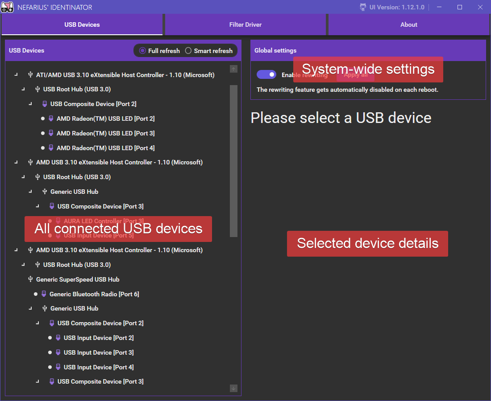
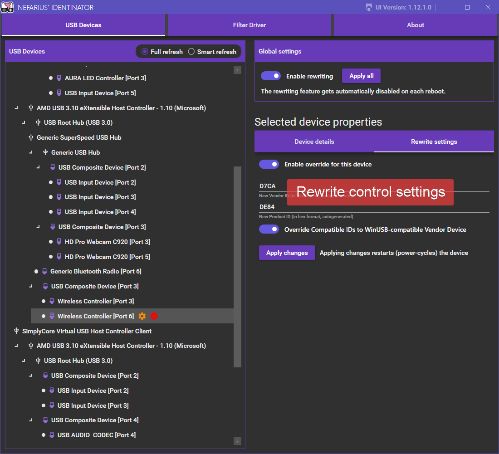
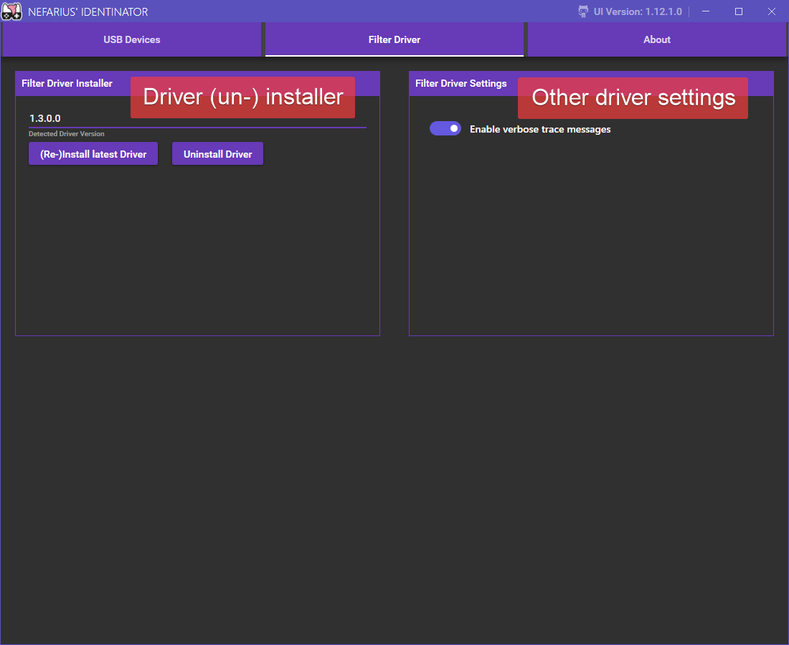
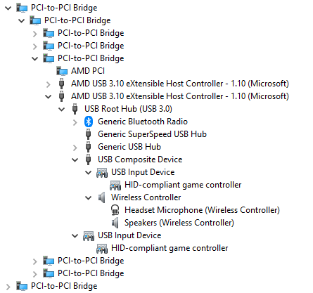
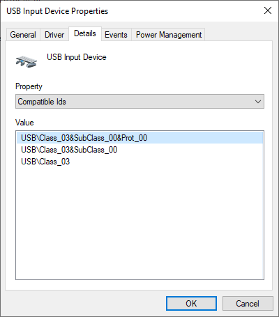
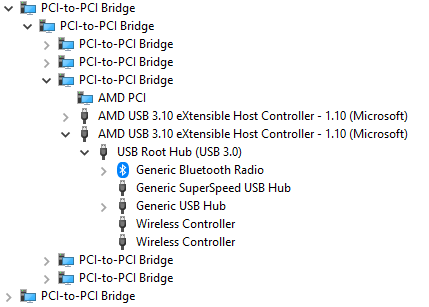
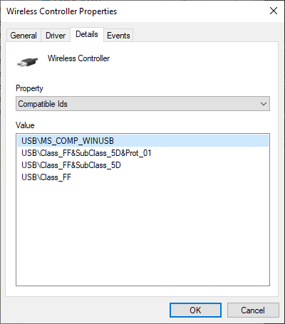

# About Nefarius' Identinator

 

!!! danger highlight "This is advanced software that won't hold your hand"
    The core feature of this software is intentionally powerful and alters essential components of how the Windows PnP subsystem detects devices and loads drivers for them. You can definitely screw up your system and/or devices if you don't know what you're doing. This is entirely YOUR responsibility, you have been warned.

The Identinator allows the user to alter (rewrite, masquerade) [Device ID](https://docs.microsoft.com/en-us/windows-hardware/drivers/install/device-ids), [Hardware ID](https://docs.microsoft.com/en-us/windows-hardware/drivers/install/hardware-ids) and [Compatible ID](https://docs.microsoft.com/en-us/windows-hardware/drivers/install/compatible-ids) properties of any USB device (Bluetooth support in the works) on a Microsoft Windows system. The solution consist of a bus filter driver (`nssidswap.sys`) and .NET UI tool to configure said driver. The changes can be applied during runtime and are instantaneous (within a few milliseconds) which can be used to "on-the-fly" swap out the function driver for e.g. HID devices.

!!! note "This is NOT a firmware flash utility"
    Identinator **does not flash** any device, the changes happen at driver level, are temporary and only apply to the machine where Identinator is installed and configured. **No changes are made** to any EEPROM, flash or other potentially reprogrammable sections of any USB device. This tool does not alter device or configuration descriptors.

## Why

While working on the [new DS4Windows fork](https://github.com/CircumSpector/DS4Windows) with a team of volunteer developers we brainstormed about various ideas on how to make the issue of device hiding a more smooth and less error-prone experience. Yes, we've got [HidHide](https://github.com/ViGEm/HidHide) integration but that project has its own weaknesses (simply due to how device stacks operate in Windows) which can't really be addressed unless you consider a serious redesign or extension of the existing design. We were reminded on how [SCP](https://github.com/nefarius/ScpToolkit/) shipped around that: by brute-force just completely replacing the function driver of the device with [WinUSB](https://docs.microsoft.com/en-us/windows-hardware/drivers/usbcon/winusb). This approach is not a simple undertaking, especially if you support more than one device you didn't manufacture and have no control over its firmware or driver packages. While there are [automated solutions available](https://github.com/pbatard/libwdi) to on-the-fly craft custom driver packages (INF file for WinUSB and self-signed catalogue file) they are in danger of becoming obsolete with tightening restrictions on driver signatures in future versions of Windows. Hot-swapping drivers of HID devices is always a gamble simply due to the fact that most will have open handles during their lifetime and the unloading of the current driver may simple be not possible without a reboot.

But then I remembered a product that actually *could* pull off runtime driver swapping for quite some time with ease: [VMware Workstation](https://www.vmware.com/products/workstation-pro.html)s USB pass-through feature! For those who do not know: VMware Workstation on Windows (potentially other OS'es, haven't checked) can "mount" USB devices into the Virtual Machine where it is then exclusively available for said machine. The switch from host (the system running Workstation) to guest (the Virtual Machine) and vice versa typically only takes a second or two and is a nice seamless experience. So what we were after was definitely possible, just needed to figure out how VMware does it and model a new filter driver after it! Easy, right?

## How

Let's start with understanding how VMware pulls off the smooth transition from host to VM. First the device of interest needs to be "hidden" from the host machine since only one system at a time is allowed to have authority over said device and send requests to it. This is achieved by swapping the primary (function) driver from whatever default to `vmusb.sys` (similar to `WinUSB.sys`), effectively handing over control to VMware's processes. Now VMware tools can spawn a virtual replica of the USB device within the VM and traffic to (and from) this device will be passed to the real physical device on the host. Sounds simple enough, right? Well, in reality we face a few problems. Most USB devices (predominantly HID devices) can not hot-swap their function driver because of open handles and other drivers higher up in the stack, so after wasting a couple of seconds this procedure would most probably error out because the driver swap and necessary device restart couldn't finish successfully during runtime. So we need to pull another trick which restarts the device and somehow alters it in a way which causes the PnP subsystem into loading `vmusb.sys` instead.

Another driver enters the scene: `vmci.sys`. This one acts as a bus filter driver for USB host controllers and hubs and does something very smart. When instructed by VMware's processes, it swaps the Hardware ID of the USB device from whatever original value to `USB\Vid_0E0F&Pid_0001` and power-cycles (port reset) the device which causes `vmusb.sys` to load onto it. `vmci.sys` intercepts [IRP_MJ_PNP](https://docs.microsoft.com/en-us/windows-hardware/drivers/kernel/irp-mj-pnp) requests made to the USB bus and alters the reported hardware ID string, therefore causing the PnP manager to look for the custom function driver instead. To pull the swap off in seconds the following sequence happens:

- User chose device (e.g. a USB joystick) to get forwarded into VM
- `vmci.sys` gets instructed to power-cycle the joystick by sending a port reset to the parent hub device
  - USB devices are "surprise removal" capable, meaning they have to expect to be unplugged at anytime, a port reset is basically a quick "reboot" of the device
- When the device comes online this time `vmci.sys` alters the hardware ID to `USB\Vid_0E0F&Pid_0001` which causes Windows to match and load `vmusb.sys` as the new function driver
- Now that `vmusb.sys` is in charge of our joystick, packets can be exchanged with the VM and the host system can no longer "see" a joystick but a custom vendor-defined USB device

The same trick is pulled off by Identinator by utilizing the `nssidswap.sys` bus filter driver which basically performs a subset of tasks like `vmci.sys` and rewrites Device ID, Hardware ID(s) and Compatible ID(s) in a way that the OS-shipped `WinUSB.sys` gets loaded instead of the original function driver.

With these quick-switch capabilities we're now able to switch to and from WinUSB during runtime without any delay or locked devices and communicate with the device directly in our software!

## UI overview

### "USB Devices" tab

The primary view of the tool. Hosts the list of host controllers, hubs and connected devices. Upon device selection, the details panel gets populated and rewrite settings can be examined.

{: .glightbox } 

Each device may have additional status indicators next to their name:

- An **orange cog**: rewrite settings exist for this device
- A **red circled checkmark**: the device is currently rewritten

{: .glightbox } 

{: .glightbox } 

!!! important "Rewriting for all devices gets disabled on each reboot"
    As a safety mechanism the global rewriting switch gets **turned off automatically on each reboot**. This is by design and ensures that the system is in its original state on a fresh boot, should something catastrophic happen while rewrite is active (loss of mouse and keyboard, BSOD due to incompatible driver etc.)!

### "Filter Driver" tab

Driver version and less important settings an be reviewed here. The filter driver can be (re-)installed or uninstalled from here.

{: .glightbox } 

### "About" tab

This tab lists copyright and license information.

## Rewrite Example

Let's take the **Sony DualShock 4 Rev2** for example; by default it is represented by a composite device. This branches off into two child devices: the "USB Input Device" which represents the HID interface which in turn gets presented as "HID-compliant game controller" and a multimedia device (named "Wireless Controller") which in turn exposes a microphone and speaker device:

{: .glightbox } 

Examining the "USB Input Device" we can look at the default Hardware and Compatible IDs which get built by the Windows driver stack based on information extracted from the USB Device Descriptor:

{: .glightbox } 

{: .glightbox } 

After applying rewrite settings, the changes can be observed:

{: .glightbox } 

!!! note "The second Wireless Controller shown..."
    ...is a Sony DualShock 4 **Rev1** that was also connected and rewritten, it is completely independent from the Rev2.

{: .glightbox } 

{: .glightbox } 

Due to the compatible IDs the stock WinUSB drivers got loaded, so the device can be directly accessed with whatever software the tinkerer sees fit. If we'd used some well-known Vendor and Product IDs a potentially incompatible driver could load onto the device and react in unforeseen ways. Using WinUSB is generally "safe" as it's a generic USB driver that ships with the operating system.
