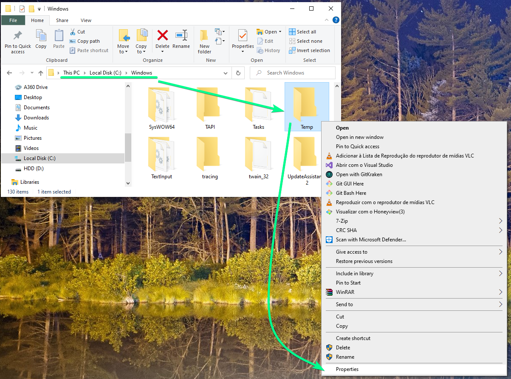
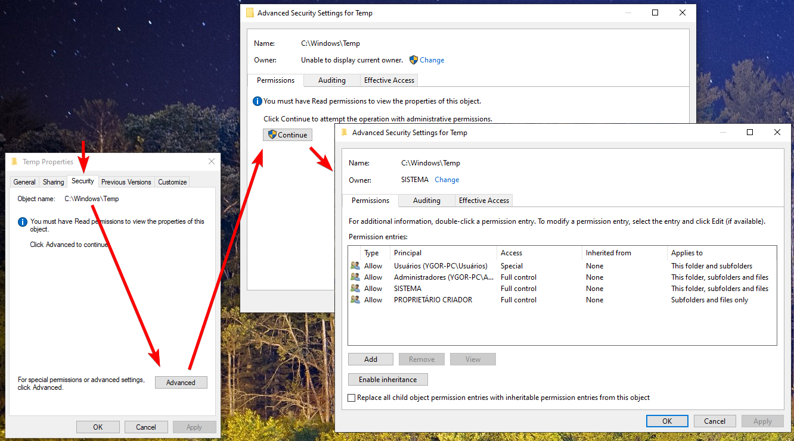
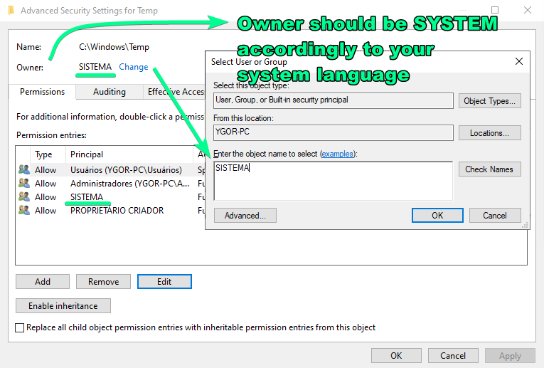
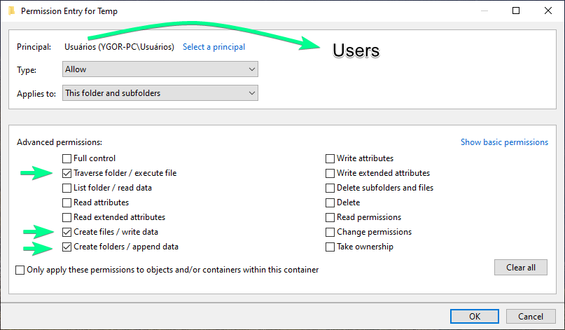
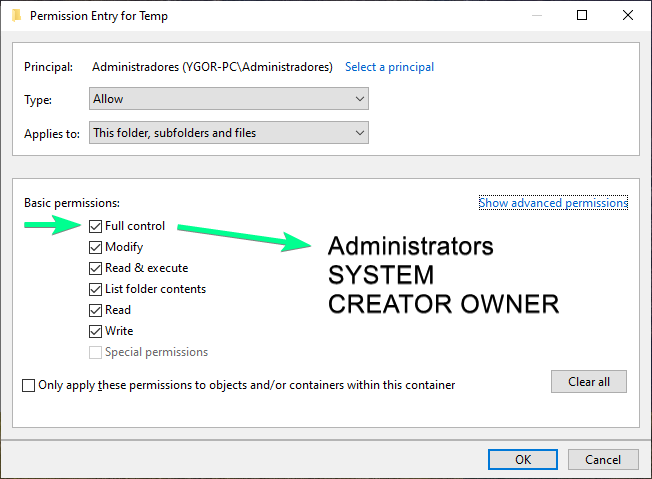
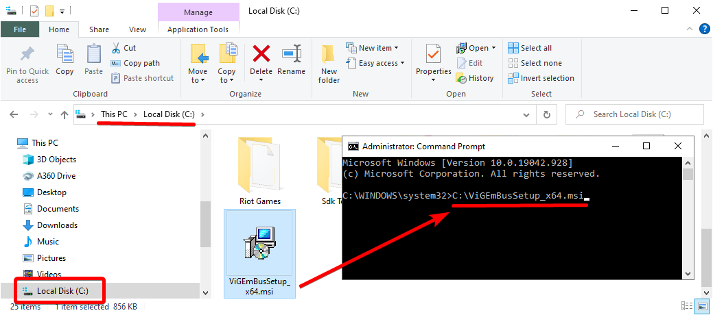
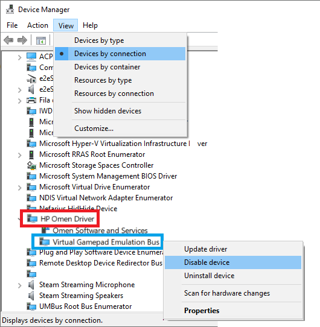
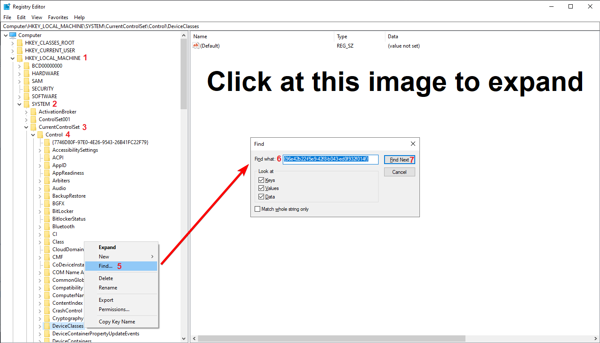
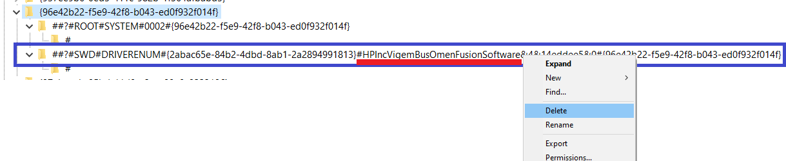

# How to Install/Remove

!!! note "Keep in mind"
    The ViGEmBus can emulate virtual Xbox 360 / DualShock 4 controllers, but since it doesn't have a user interface it doesn't do so by itself. It is a tool that needs to be used by [_other_ applications](since there is no user interface for it).

## Installation

- Download the [latest setup of ViGEmBus](https://github.com/ViGEm/ViGEmBus/releases) according to your system architecture. The setup should be a file named `ViGEmBusSetup_xXX.msi`
- Run the setup and follow the instructions until it is installed

And congratulations! ViGEmBus

If you ran into some error, have a look at our [troubleshooting section](#Troubleshooting).

## Updating

If you want to update, simply follow all the same steps of the installation.

## Removal

If you want to remove ViGEm from your computer you just need to use its built-in uninstaller:

- Open Windows 10's `Apps and Features` by pressing ++win+x++ and selecting it from the menu
- Use the search box _in the middle_ to look for `Emulation` or `Nefarius`
- Click on the `Nefarius Nefarius Gamepad Emulation Bus Driver` and select  `Uninstall`  
{: .glightbox }  
- Follow the uninstaller's instructions
- After ViGEm is uninstalled, reboot your computer

That should do the trick. If you want to be absolutely sure that there are no traces left of the ViGEmBus on your system, have a look at our [troubleshooting section](#troubleshooting)

## Troubleshooting

!!! important "Section based on the latest version!"
    The whole troubleshooting section is based on top of the __latest version of ViGEmBus__. If you are using or trying to install an older version, then your experience will greatly differ and following this section may actually cause more issues.

### General health checks

The ViGEmBus has no user interface, but don't worry, it's easy to verify if everything is working as expected when you know where to look:

- Open Device Manager by pressing ++win+x++ and selecting it from the menu:  
{: .glightbox }  
- Click on the `View` tab at the top and change the view type to `Devices by connection`
- Look for entries named `Nefarius Virtual Gamepad Emulation Bus` _and_ `Virtual Gamepad Emulation Bus`

If when counting both types you have more than one entry, then you have multiple version of ViGEmBus installed and it is better if you follow the [full clean section](#purging-every-trace-of-vigembus). If you have only one entry and it is the one starting with `Nefarius` then continue following this section:

- Right click on the `Nefarius Virtual Gamepad Emulation Bus` then select `properties`
- At the `General` tab, its status should be `working properly`
- At the `Driver` tab the `Driver Version` should match the latest version you downloaded and installed  
{: .glightbox }  

If everything matches the instructions, then things should work as expected. A special case is when the user has a laptop from the HP Omen Gaming line. If this is your case, have a look at the [_Vigem issues in HP Omen laptops_ section](#vigem-issues-in-hp-omen-laptops).

### Setup error, code 2503

!!! note "If the vigem setup finishes installing without error messages then you are not facing this issue"

This issue is related to the Windows' `Temp` folder having broken permissions or the user not having administrator privileges. There are 2 ways to fix this:

- The proper way, which involves fixing the folder's permission, or...
- The lazy way, which just force the installer to run with administrator privileges

#### Fixing the Temp folder's permissions

!!! important "Be aware of your system language!"
    The images and instructions used as examples may not match perfectly your experience, so do things accordingly to how your system presents itself on its language.

- Navigate to the `Windows` folder at the root of your local disk
- Find the `Temp` folder, right-click on it then select `Properties`  
{: .glightbox } 
- Go to the `Security` tab and then select `Advanced`
- Below the `Click Continue to attempt the operation with administrative permissions` message select `Continue`
{: .glightbox } 
- Verify if the `Owner`, at the top, is `System`. If it's not, select the `Change` button at its right side, write `System` on the appearing window and then confirm  
{: .glightbox } 
- On the middle list, select the entry `Users (Your Username/Users)` and select `Edit`. At the right side of the appearing window, select `Show advanced permissions` and then leave only the following three permissions marked: `Traverse folder / execute file`, `Create files / write data` and `Create folders / append data`  
{: .glightbox } 
- Edit the `Administrators`, `SYSTEM` and `CREATOR OWNER` entries so they have `Full Control`  
{: .glightbox } 
- When all is done, confirm the changes in every window by selecting `OK`  

After Windows finishes applying the changes, try running Vigem's installer again and it should succeed now.

#### Running the .msi installer with administrator privileges
!!! important "Not recommended!"
    This is the "_I don't want to solve the actual issue, just install vigem no matter how_". You will probably succeed, but not fixing the folder's permission can cause issues in other situations.

- Move the ViGEmBus `.msi` installer to the root of your Local Disk
- Open `Command Prompt (Admin)` by pressing ++win+x++ and selecting it from the menu
- On the command prompt, write `C:\ExactNameOfTheInstallerHere.msi`, then press Enter. See the example in the image to better understand it
{: .glightbox } 

And done. This should be enough for the Setup to complete installation, though if your windows `Temp` folder permissions are actually broken they will remain so, possibly causing issues in other situations.

### Purging every trace of ViGEmBus

If you are facing issues and/or have multiple ViGEmBus entries in your Device Manager it's best to remove every trace of it from your system to start clean again:

- First, follow the [removal section](#removal) to uninstall ViGEmBus via the normal way so we can tackle things in order
- After uninstalling Vigem by using its uninstaller, reboot your computer
- Open Device Manager by pressing ++win+x++ and selecting it from the menu
- Click on the `View` tab at the top and select `Devices by connection`
- For each entry that exists with the name of `Nefarius Virtual Gamepad Emulation Bus` or `Virtual Gamepad Emulation Bus`, right click on them and select `Uninstall` then give confirmation when asked to

Having no ViGEmBus entries left at the Device Manager does not mean your system is fully rid of it, so let's continue:

- Download and open the [Driver Store Explorer](https://github.com/lostindark/DriverStoreExplorer/releases)
- On its interface, click at the `INF` bar at the top left side so the list gets ordered by name
- Scroll to the `V` letter section and mark every entry of `vigembus.inf`. __BE CAREFUL TO NOT MARK ANYTHING ELSE!__ After that, on the right side, mark the `Force Deletion` checkbox and then click on `Delete Driver`
- Reboot your computer
- Verify again on the Driver Store Explorer if there are no entries left of `vigembus.inf` and if there are no entries left of `(Nefarius) Virtual Gamepad Emulation Bus` on the Device Manager. If there are, repeat this section

And done, no Vigem left anywhere! Now it's safe to try re-installing the latest version according to the [installation section](#installation).

### Vigem issues in HP Omen laptops

HP's line of Omen gaming laptops come pre-installed with a modified version of the ViGEmBus driver. Apps trying to locate the latest ViGEmBus may end up detecting the modified HP driver instead, causing all sorts of issue since it is based on an older version (v1.4.3.X).

To fix this, HP's ViGEm driver must be disabled and its entry in Windows' registry deleted:

- Open Device Manager by pressing ++win+x++ and selecting it from the menu
- Click on the `View` tab at the top and change the view type to `Devices by connection`
- Look for the `HP Omen Driver` and expand it, then right-click on the `Virtual Gamepad Emulation Bus` under it and select `Disable device`  
{: .glightbox } 
- After confirming the driver is disabled, open the Windows `Run` tool by pressing ++win+r++ and executing the `regedit` command. Windows' registry should then open
- Navigate, __carefully__, to `HKEY_LOCAL_MACHINE\SYSTEM\CurrentControlSet\Control\DeviceClasses`, as shown in the image below. When you reach `DeviceClasses`, right click on it and choose `Find`. Paste `{96e42b22-f5e9-42f8-b043-ed0f932f014f}` on the appearing search box and then select `Find Next`
{: .glightbox }  
- The search function should lead you to a folder. Expand it and look for a folder called `SWD\DRIVERENUM{2abac65e-84b2-4dbd-8ab1-2a2894991813}#HPIncVigemBusOmenFusionSoftware&4&14eddee5&0` (Emphazis on the __HPIncVigemBUS__ in the middle of its name)
- Right click on the `(...)HPIncVigemBUS(...)` entry and then delete it. Be EXTRA CAREFUL so you don't delete the wrong entry  
{: .glightbox } 

Deleting that entry should solve the problem for good, but keep in mind that HP's `Virtual Gamepad Emulation Bus` must remain disabled on the Device Manager, otherwise it will recreate that entry after every system reboot... like a virus...  

### Other issues

This guide should cover all known issues regarding the ViGEmBus setup, so give it a good read.

If you are facing another issue that is not covered here, feel free to reach us [through the proper means](https://vigem.org/Community-Support/).