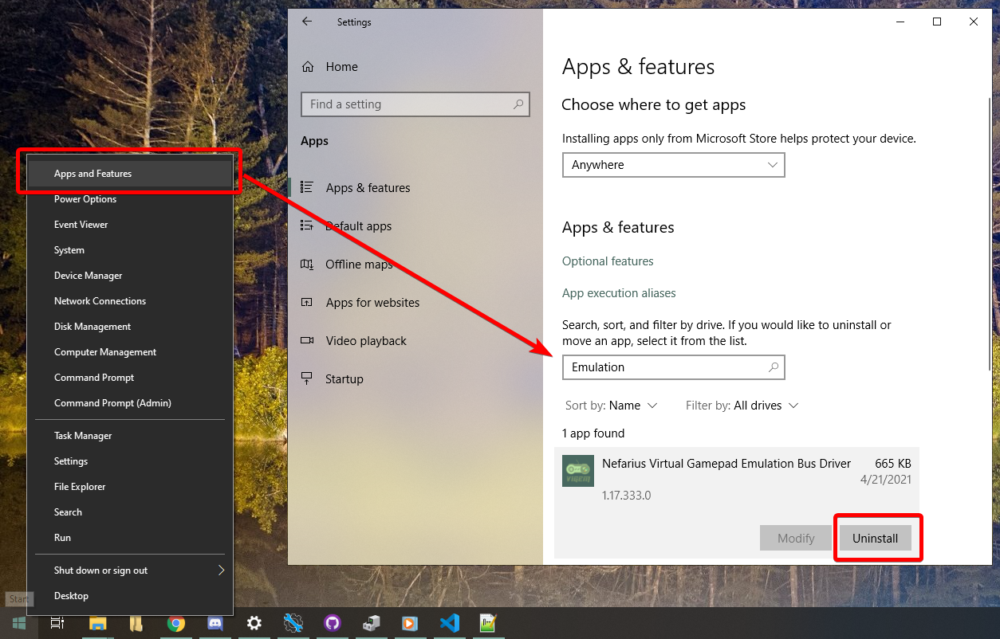
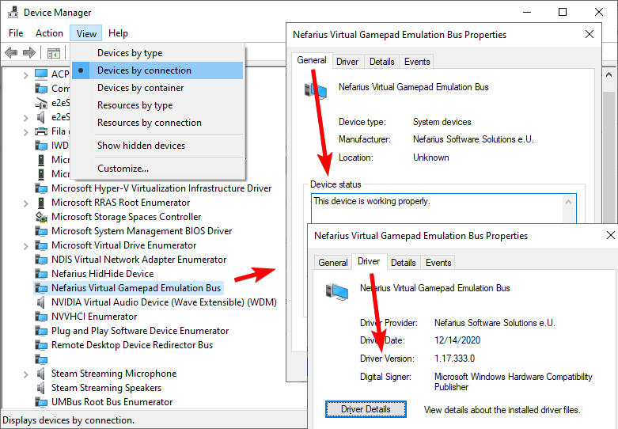

# How to Install/Remove

!!! note "There is no GUI"
    ViGEmBus is a low-level emulator **library** (framework) for USB game controllers, it doesn't have a user interface. You need software *building upon* ViGEmBus to make things happen 😉 If you don't know what that means, you're in the wrong place and most probably shouldn't install it 😘

## Installation

- Download the [latest setup of ViGEmBus](https://github.com/ViGEm/ViGEmBus/releases) matching your [system architecture](https://vigem.org/research/How-to-check-architecture/). It's a file named `ViGEmBusSetup_xXX.msi`
- Run the setup and follow the instructions

Congratulations! That was it, ViGEmBus is now ready to use.

In case you are experiencing issues, have a look at the [troubleshooting section](#Troubleshooting).

## Updating

Updating simply involves downloading the latest setup and following the exact same steps.

## Removal

!!! attention "This depends on the software you use"
    Some programs "bundle" ViGEmBus with it (e.g. silently install a copy on their own), either with or without the users consent. This method is out of our reach; please contact the distributor of said software, we can't aid in this case.

### Apps and Features method

The usual way consists in using its built-in uninstaller:

- Open Windows 10's `Apps and Features` by pressing ++win+x++ and selecting it from the menu
- Use the search box _in the center_ to look for `Emulation` or `Nefarius`
- Click on `Nefarius Nefarius Gamepad Emulation Bus Driver` and select `Uninstall`
{: .glightbox }  
- Follow the uninstaller's instructions
- Done. If you get prompted to reboot, do so and that's it!

### .msi installer method

This method is useful when the ViGEmBus entry doesn't appear in the Windows' Apps lists at `Apps and Features`:

- Just follow the same steps of the [installation section](#installation), but choose the `remove` when it appears  
{: .glightbox }  
- Done. If you get prompted to reboot, do so and that's it!

That should do the trick. If you want to be absolutely sure that there are no traces left of the ViGEmBus on your system, have a look at the [troubleshooting section](#troubleshooting)

## Troubleshooting

!!! important "Section based on the latest version!"
    The whole troubleshooting section is based on top of the __latest version of ViGEmBus__. If you are using or trying to install an older version, then your experience will greatly differ and following this section may actually cause more issues. Use common sense 🙂

### General health checks

The ViGEmBus has no user interface, but don't worry, it's easy to verify if everything is working as expected when you know where to look:

- Open Device Manager by pressing ++win+x++ and selecting it from the menu:  
{: .glightbox }  
- Click on the `View` tab at the top and change the view type to `Devices by connection`
- Look for entries named `Nefarius Virtual Gamepad Emulation Bus` _or_ `Virtual Gamepad Emulation Bus`

If more than one entry appears, you might have multiple version of ViGEmBus installed which may cause conflicts. Follow the [full clean section](#purging-every-trace-of-vigembus).

If you have only one entry and it is the one starting with `Nefarius` then continue following this section:

- Right click on the `Nefarius Virtual Gamepad Emulation Bus` then select `Properties`
- At the `General` tab, its status should be `working properly`
- At the `Driver` tab the `Driver Version` should match the latest version you downloaded and installed  
{: .glightbox }  

If everything matches the instructions, then things should work as expected. A special case is when the user has a laptop from the HP Omen Gaming line. If this is your case, have a look at the [_ViGEm issues in HP Omen laptops_ section](#vigem-issues-in-hp-omen-laptops).

### ViGEmBus issues in HP Omen laptops

HP's line of Omen gaming Laptops/Desktops come pre-installed with a modified (forked) version of the ViGEmBus driver (from 2018). Apps trying to locate the latest ViGEmBus may end up detecting the modified HP driver instead, causing all sorts of issue since it is based on an outdated version.

If this is your situation, [follow the guide outlined here](https://github.com/ViGEm/ViGEmBus/issues/99).

### Purging every trace of ViGEmBus

If you are facing issues and/or have multiple ViGEmBus entries in your Device Manager it's best to remove every trace of it from your system to start clean again:

- First, follow the [removal section](#removal) to uninstall ViGEmBus via the normal way so we can tackle things in order
- After uninstalling ViGEmBus by using its uninstaller, reboot your computer
- Open Device Manager by pressing ++win+x++ and selecting it from the menu
- Click on the `View` tab at the top and select `Devices by connection`
- For each entry that exists with the name of `Nefarius Virtual Gamepad Emulation Bus` or `Virtual Gamepad Emulation Bus`, right click on them and select `Uninstall` then give confirmation when asked to

Having no ViGEmBus entries left at the Device Manager does not mean your system is fully rid of it, so let's continue:

- Download and open the [Driver Store Explorer](https://github.com/lostindark/DriverStoreExplorer/releases)
- On its interface, click at the `INF` bar at the top left side so the list gets ordered by name
- Scroll to the `V` letter section and mark every entry of `vigembus.inf`. __BE CAREFUL TO NOT MARK ANYTHING ELSE!__ After that, on the right side, mark the `Force Deletion` checkbox and then click on `Delete Driver`
- Reboot your computer
- Verify again on the Driver Store Explorer if there are no entries left of `vigembus.inf` and if there are no entries left of `(Nefarius) Virtual Gamepad Emulation Bus` on the Device Manager. If there are, repeat this section

And done, no ViGEmBus left anywhere! Now it's safe to try re-installing the latest version according to the [installation section](#installation).

### Other issues

This guide should cover all known issues regarding the ViGEmBus setup, so give it a good read.

If you are facing another issue that is not covered here, feel free to reach us [through the proper means](https://vigem.org/Community-Support/).
